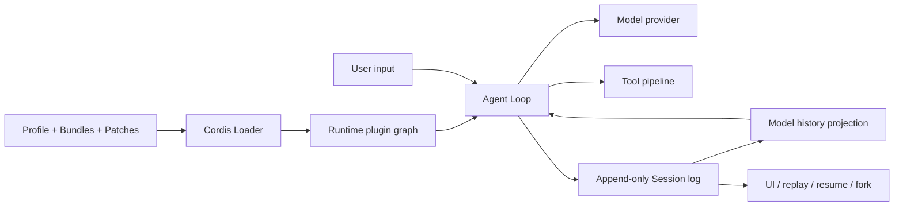

# DeepSeek Harness Technical Guide

[English](GUIDE.md) | [简体中文](GUIDE_zh.md) | [繁體中文](GUIDE_tw.md) | [日本語](GUIDE_ja.md) | [한국어](GUIDE_ko.md) | [Deutsch](GUIDE_de.md) | [Español](GUIDE_es.md) | [Français](GUIDE_fr.md) | [Italiano](GUIDE_it.md) | [Português](GUIDE_pt.md) | [Русский](GUIDE_ru.md) | [العربية](GUIDE_ar.md) | [Bahasa Indonesia](GUIDE_id.md) | [ไทย](GUIDE_th.md) | [Tiếng Việt](GUIDE_vi.md)

This guide explains how DeepSeek Harness (`dsh`) works beneath the slogan “Everything is a Plugin.” It is informed by the Chinese article [“DSH: DeepSeek Harness Architecture Explained”](https://mp.weixin.qq.com/s/Kf87hcNdSmY4ODWI4UZ8cg) and cross-checked against the [official source](https://github.com/deepseek-ai/deepseek-harness), [architecture guide](https://github.com/deepseek-ai/deepseek-harness/blob/master/docs/architecture.md), and [Cordis paper](https://github.com/cordiverse/paper).

> [!WARNING]
> DeepSeek Harness is in developer preview. The referenced article analyzes DSH commit `47f9438` and independent Cordis commit `8cc9e33`, while the official projects continue to change. Treat package names, presets, configuration fields, and internal behavior as version-sensitive; verify them against the revision you use.

## The central mental model

DeepSeek Harness is easiest to understand as two coordinated systems:

1. **The runtime plugin graph** answers: “What capabilities exist now, where are they visible, and who owns their lifecycle?” Cordis maintains this graph through Contexts, Services, Fibers, Effects, Events, and the Loader.
2. **The append-only session event stream** answers: “What happened during this agent session?” The session log records durable facts and projects them into model history, UI state, recovery, forks, and telemetry.

The Agent Loop connects the two. It obtains models, prompts, tools, policies, and storage from the plugin graph, performs work, and writes durable results back to the event stream.



A minimal agent loop can be written in a few lines. A product harness must additionally coordinate credentials, model routing, permissions, sandboxing, sessions, compaction, subagents, multiple hosts, UI observation, plugin installation, and safe teardown. DSH puts composition pressure into Cordis and continuity into Session.

## From configuration to a live graph

DSH does not boot a single fixed application. It composes one from ordered configuration layers:

1. Bundles listed by the selected Profile.
2. The Profile's own `cordis.patch.yml`.
3. The Harness-home patch.
4. Command-line `--patch` overlays.

Later layers replace a complete configuration row by ID or insert a new row. They do not simply deep-merge every nested value. The effective runtime therefore cannot be inferred from imports alone.

```bash
dsh --profile web --dump-config
```

Use the dumped configuration as the first diagnostic artifact. It shows what the current machine will actually mount.

### Plugin, Bundle, Profile, and Patch

| Concept | Responsibility |
| --- | --- |
| Plugin | Executable capability mounted into a Cordis Context. |
| Bundle | Distributable npm package that contributes plugin rows through `dsh.bundle`. |
| Profile | Named runnable composition of ordered Bundles plus local dependencies and overrides. |
| Patch | Deployment-time YAML overlay that inserts or replaces rows. |
| Agent preset | Per-session composition of tools, prompts, persona, and scoped Services. |

Runtime Profiles and Agent presets are different axes. A Web process can host sessions using different presets; a preset is not necessarily a separate process architecture.

The referenced source snapshot described `web` and `headless` as process-level Profiles, and four session-level presets:

| Snapshot preset | Architectural purpose |
| --- | --- |
| `standard` | Full coding-agent tool composition. |
| `code` | Reuses the tool registry and pipeline but presents tools through a code-oriented protocol. |
| `minimal` | Narrows the model-visible tool surface for a smaller composition. |
| `cordis` | Adds runtime inspection and temporary plugin-management capabilities. |

These names and exact contents are observations from that snapshot, not stable compatibility promises. Runtime-generated JavaScript or temporary plugins remain privileged code.

## Cordis runtime mechanics

### Which Cordis is authoritative?

Three related artifacts answer different questions:

- The **paper** defines the intended model and the conditions behind its composability claims.
- The independent **Cordis repository** shows an upstream implementation snapshot.
- The **Cordis source vendored by DSH** is what a particular DSH revision actually runs, including local hardening and divergence.

When debugging DSH behavior, follow its vendored source and lockfile first. A package version or paper-level property cannot replace verification of the implementation in the selected DSH commit.

### Context: visibility and ownership

Plugins collaborate through a `ctx` object. It behaves like a Service lookup boundary rather than a bag of global singletons. A Context carries parent relationships, isolated Service realms, dependency declarations, and the current Fiber that owns newly registered Effects.

Child Contexts normally inherit Services. Isolation creates a new realm for a named Service, allowing two agents to resolve `ctx.tools` or `ctx.fs` to different providers without duplicating consumers.

Dependency injection is a composition contract, not an operating-system permission boundary. A same-process JavaScript plugin can still import Node.js APIs unless a real sandbox prevents it.

### Service: stable capability seams

A replaceable capability normally has three roles:

- **Service Definition** — the interface and shared semantics.
- **Service Provider** — a local, remote, sandboxed, or test implementation.
- **Consumer** — code that uses the Service, often through a model-visible tool.

Consumers declare required Services in `inject`. If a required Provider is missing, the plugin waits instead of starting with a partially initialized dependency graph. When Provider identity changes, dependent Fibers can be unloaded and mounted again against the new implementation.

### Fiber: one live plugin instance

A Plugin is reusable code; a Fiber is one concrete mount of that code with a parent Context, configuration, resolved dependencies, lifecycle state, and owned cleanup functions.

This distinction matters because the same Plugin can run multiple times in different scopes. Cordis continuously reconciles Fiber activation with Service availability rather than resolving dependency order only once at boot.

### Effect: structured cleanup

Plugins create listeners, registrations, timers, processes, connections, and file handles. `ctx.effect()` associates resource acquisition with a disposer owned by the current Fiber:

```ts
export function apply(ctx: Context) {
  ctx.effect(() => {
    const timer = setInterval(runMaintenance, 5_000)
    return () => clearInterval(timer)
  })
}
```

Helpers such as `ctx.on()` and `ctx.provide()` also participate in lifecycle ownership. This makes unload, configuration replacement, test isolation, and hot module replacement share one retirement path.

Effects are not transactions. They only clean up resources the plugin correctly registered. They cannot automatically compensate an external payment, undo a published message, or make repeated command execution safe.

### Event: observation and interception

Cordis provides several event shapes for different coordination needs:

| Shape | Typical use |
| --- | --- |
| `emit` | Synchronous notification to all listeners. |
| `parallel` | Independent asynchronous observers. |
| `serial` | Ordered decision; stop after an accepted result. |
| `bail` | Synchronous short-circuit decision. |
| `waterfall` | Middleware that can wrap, rewrite, delegate, or stop the remaining chain. |

DSH uses middleware-style extension points around model requests and tool execution. Policies, approvals, prompt injection, and adapters can attach to a seam instead of adding more branches to the default loop.

### Loader: configuration becomes lifecycle

The Loader imports each configuration Entry, prepares its Context, and asks the Registry to create a Fiber. When an Entry is disabled, changed, or removed, the corresponding Fiber is updated or disposed.

This is where “extensible in source” becomes “replaceable in deployment.” If replacing a Provider still requires editing boot code, the choice remains inside the program; when a Patch can replace the row, deployment owns the choice.

## Agent execution and durable history

### Turn and Step

A **Step** generally covers a model request and the tools called because of it. A **Turn** can contain zero or more Steps and ends when no continuation is owed.

```text
turn/start
  claim input
  assemble prompt sections and tool schemas
  agent/pre-step
    step/start
    user/message
    derive model history
    agent/request -> llm/stream
    assistant/chunk* -> assistant/message
    tool/call* -> pre-execute -> execute -> post-execute -> tool/result*
    step/end
  continue if tools or queued input require another Step
  agent/turn-stopping
turn/end
```

Not every event has the same persistence semantics:

- **Session events** are durable facts such as turn boundaries, messages, chunks, tool calls, and results.
- **Agent events** coordinate live inbox, validation, request, continuation, and status behavior.
- **Capability events** add policy or adapters around seams such as filesystem, tools, or telemetry.

### “Model-visible means logged”

The canonical Session log must be able to reconstruct anything sent to the model. This does not mean every internal scheduler state becomes a model message, or that the full log is sent on every request.

`deriveMessages()` projects a current model-facing surface from the event log. Streaming chunks can remain available for replay without being duplicated beside the final assistant message. Turn boundaries and statistics need not become model messages. Compaction can append a replacement that hides older surface content while preserving original events.

Therefore:

- complete recording is different from complete re-sending;
- disk log length is different from prompt length;
- replayable history is different from replay-safe external side effects.

The append-only design improves recovery, forks, auditability, and UI fidelity, but increases storage, migration, retention, and privacy obligations. Tool arguments, command output, file content, user input, and provider-returned reasoning chunks may all be sensitive.

## Dynamic composition and prompt caching

Re-reading a dynamic plugin graph does not automatically destroy prefix caching. If the model-visible system prompt, tool schemas, route, and history prefix remain stable, the reconstructed request prefix can remain identical.

Cache invalidation occurs when runtime change reaches the model surface—for example, tools change, prompt sections change, the model changes, or compaction replaces history. Keep stable sections and tools deterministically ordered, isolate volatile data, and measure cache behavior at the provider boundary.

Provider prefix caching reuses computation; it does not shrink the model's logical context or make cached input disappear from every usage metric.

## Security boundaries

Plugin composition and sandboxing solve different problems:

- `inject` documents and enforces Context-level dependencies; it does not revoke Node.js access.
- Effects manage lifecycle ownership; they do not roll back external transactions.
- Worker threads isolate some execution mechanics; they are not automatically a permission boundary.
- Build scripts from Git dependencies execute during installation when explicitly allowed; review source and pin a commit.
- Runtime-generated JavaScript and temporary plugins should be treated as highly privileged code.
- Approval policies protect tool execution only when all relevant providers and tools actually pass through those policy seams.

For third-party plugins, review install scripts, direct Node imports, network access, credentials, filesystem scope, subprocess use, data retention, telemetry, and cleanup behavior.

## The boundary of “Everything is a Plugin”

The slogan accurately describes how DSH organizes application capabilities, but it is not literally recursive. A root Context, Registry, Events implementation, Fiber lifecycle, Loader, and boot path must exist before the plugin graph can be created.

The core has moved downward: instead of hard-coding agent product behavior, DSH keeps a smaller composition kernel that allows most product capabilities to use a uniform mechanism.

This has clear tradeoffs.

### Benefits

- One composition model for tools, providers, UI, policies, storage, and modes.
- Late-bound dependencies and scoped Provider replacement.
- Explicit resource ownership and a common unload path.
- Deployment-time composition through Profiles, Bundles, and Patches.
- Inspectable runtime topology and a foundation for controlled experiments.

### Costs

- Static imports no longer describe the effective system.
- Provider replacement may trigger a larger chain of Fiber reloads.
- Debugging requires Context, realm, Fiber, and effective configuration evidence.
- Reversible Effects depend on correct plugin discipline and are not transactions.
- Same-process plugins remain trusted code without a stronger sandbox.
- Runtime overhead and large-graph reconciliation still need representative benchmarks.

## A source-reading workflow

When diagnosing or extending DSH, follow three threads in order:

1. **Configuration:** inspect `dsh --dump-config` and identify the exact Entry and parent tree.
2. **Capability:** trace the Service Definition, `provide`/`inject` relationship, Context realm, owning Fiber, and Effects.
3. **History:** trace Session events into `deriveMessages()` and verify what the model actually receives.

This workflow is more reliable than starting from the slogan or following imports alone.

## Plugin author checklist

- [ ] Choose an existing Service or Event seam before changing the Agent Loop.
- [ ] Declare every required Service through `inject`.
- [ ] Put deployment-specific values in a validated `Config` schema.
- [ ] Register listeners, Services, timers, and handles through lifecycle-aware helpers.
- [ ] Define explicit cleanup for resources with external handles.
- [ ] Treat cleanup order and failure behavior as part of the contract.
- [ ] Decide whether state belongs to the host, an Agent scope, or durable Session history.
- [ ] Ensure every model-visible input is reconstructable from the Session log.
- [ ] Preserve deterministic prompt-section and tool ordering.
- [ ] Route sensitive operations through sandbox and approval seams.
- [ ] Test load, missing dependency, Provider replacement, config update, unload, and restart.
- [ ] Test compaction, resume, and fork behavior when adding Session events.
- [ ] Package the plugin as a Bundle and verify the final tree with `--dump-config`.
- [ ] Pin and review third-party code before granting install-time build permission.

## Project roadmap

This community guide will grow in small, reviewable layers:

- architecture glossary and diagrams;
- verified minimal plugins and tool examples;
- configuration, lifecycle, and Session event test fixtures;
- security review and release checklists;
- plugin case studies linked to exact upstream revisions;
- reusable Agent Skills for exploration, scaffolding, tool building, and review;
- translation synchronization and native-speaker review.

See [CONTRIBUTING.md](CONTRIBUTING.md) for contribution rules.

## References

- [Referenced Chinese article](https://mp.weixin.qq.com/s/Kf87hcNdSmY4ODWI4UZ8cg)
- [DeepSeek Harness](https://github.com/deepseek-ai/deepseek-harness)
- [Official architecture guide](https://github.com/deepseek-ai/deepseek-harness/blob/master/docs/architecture.md)
- [Official first-plugin tutorial](https://github.com/deepseek-ai/deepseek-harness/blob/master/docs/user/develop/basic/index.md)
- [Official plugin packaging guide](https://github.com/deepseek-ai/deepseek-harness/blob/master/docs/user/develop/basic/publish.md)
- [Cordis](https://github.com/cordiverse/cordis)
- [A Programming Paradigm for Spatiotemporal Composability](https://github.com/cordiverse/paper)
