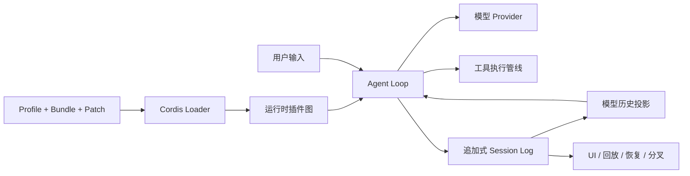

# DeepSeek Harness 技术指南

[English](GUIDE.md) | [简体中文](GUIDE_zh.md) | [繁體中文](GUIDE_tw.md) | [日本語](GUIDE_ja.md) | [한국어](GUIDE_ko.md) | [Deutsch](GUIDE_de.md) | [Español](GUIDE_es.md) | [Français](GUIDE_fr.md) | [Italiano](GUIDE_it.md) | [Português](GUIDE_pt.md) | [Русский](GUIDE_ru.md) | [العربية](GUIDE_ar.md) | [Bahasa Indonesia](GUIDE_id.md) | [ไทย](GUIDE_th.md) | [Tiếng Việt](GUIDE_vi.md)

本指南参考了 lencx 的文章[《DSH：DeepSeek Harness 架构解析》](https://mp.weixin.qq.com/s/Kf87hcNdSmY4ODWI4UZ8cg)，并使用 [DeepSeek Harness 官方源码](https://github.com/deepseek-ai/deepseek-harness)、[架构文档](https://github.com/deepseek-ai/deepseek-harness/blob/master/docs/architecture.zh.md)和 [Cordis 论文](https://github.com/cordiverse/paper)交叉核对，解释“一切皆插件”背后的运行机制。

> [!WARNING]
> DeepSeek Harness 仍处于开发者预览阶段。参考文章分析的是 DSH Commit `47f9438` 与独立 Cordis Commit `8cc9e33`，而官方项目仍在快速迭代。Package 名称、Preset、配置字段与内部行为都可能随版本变化，请以实际使用的 Commit 为准。

## 最重要的心智模型

理解 DeepSeek Harness（`dsh`）最有效的方式，是把它看成两套相互协作的系统：

1. **运行时插件图**回答“系统当前由什么组成、能力在哪里可见、生命周期归谁管理”。Cordis 通过 Context、Service、Fiber、Effect、Event 与 Loader 维护这张图。
2. **追加式会话事件流**回答“这个 Agent 会话已经发生了什么”。Session Log 保存持久事实，并将它们投影为模型历史、UI 轨迹、恢复、分叉与遥测数据。

Agent Loop 位于两者之间：从插件图获取模型、提示词、工具、策略与存储能力，完成执行，再把持久结果写回事件流。



最小 Agent Loop 只需拼接 Prompt、请求模型、执行工具并把结果送回模型。产品级 Harness 还要处理凭证、模型路由、权限、沙箱、会话、压缩、子 Agent、多种宿主、UI 观察、插件安装与可靠退出。DSH 将组合复杂度交给 Cordis，将历史连续性交给 Session。

## 从配置到运行图

DSH 不直接启动一个固定应用，而是按顺序叠加配置层：

1. 所选 Profile 声明的 Bundle。
2. Profile 自己的 `cordis.patch.yml`。
3. Harness Home 下的 Patch。
4. 命令行 `--patch` 覆盖层。

后应用的层会按 ID 替换完整配置行，或者插入新行，并非对所有嵌套值做无条件深度合并。因此，只看 Import 关系无法得知实际运行了什么。

```bash
dsh --profile web --dump-config
```

排查问题时，应先保存这份最终配置。它才是当前机器实际挂载内容的证据。

### Plugin、Bundle、Profile 与 Patch

| 概念 | 职责 |
| --- | --- |
| Plugin | 挂载进 Cordis Context 的可执行能力。 |
| Bundle | 通过 `dsh.bundle` 分发插件配置行的 npm Package。 |
| Profile | 由有序 Bundle、本地依赖和覆盖配置组成的可运行组合。 |
| Patch | 在部署时插入或替换配置行的 YAML 覆盖层。 |
| Agent Preset | 为单个会话组合工具、提示词、人格与局部 Service。 |

Runtime Profile 与 Agent Preset 是两条不同的轴。一个 Web 进程可以同时承载使用不同 Preset 的会话；Preset 不等于另一套进程架构。

参考文章所使用的源码快照包含 `web`、`headless` 两种进程级 Profile，以及四种会话级 Preset：

| 快照中的 Preset | 架构用途 |
| --- | --- |
| `standard` | 完整 Coding Agent 工具组合。 |
| `code` | 复用工具注册与执行管线，但通过面向代码的协议向模型呈现工具。 |
| `minimal` | 收窄模型可见的工具 Surface，形成更小的组合。 |
| `cordis` | 增加运行时检查与临时插件管理能力。 |

这些名称与具体内容只是对应快照中的实测观察，不构成稳定兼容性承诺。运行时生成的 JavaScript 或临时插件仍然属于高权限代码。

## Cordis 运行机制

### 应该以哪一份 Cordis 为准？

三份相关材料回答的问题不同：

- **论文**描述目标模型，以及可组合性结论成立所需的条件。
- 独立的 **Cordis 仓库**代表一份上游实现快照。
- **DSH Vendored Cordis** 才是特定 DSH 版本真正执行的实现，其中可能包含本地加固与语义差异。

排查 DSH 行为时，应优先检查它实际 Vendored 的源码与 Lockfile。Package 版本号或论文性质，都不能替代对所选 DSH Commit 中真实实现的核对。

### Context：能力可见范围与资源归属

插件通过 `ctx` 协作。它不是全局单例集合，而是 Service 解析边界，携带父子关系、隔离 Realm、依赖声明，以及拥有新 Effect 的当前 Fiber。

子 Context 默认继承父级 Service；对某个 Service 建立隔离 Realm 后，不同 Agent 可以让 `ctx.tools` 或 `ctx.fs` 解析到不同 Provider，而不必复制 Consumer。

依赖注入是组合约束，不是操作系统权限边界。同进程 JavaScript 插件即使没有注入 `fs`，仍可能直接导入 Node.js API；真正限制权限需要沙箱。

### Service：稳定的能力接缝

一个可替换能力通常包含三个角色：

- **Service Definition**：接口与公共语义。
- **Service Provider**：本地、远程、沙箱或测试实现。
- **Consumer**：使用该 Service 的代码，常见形式是模型可见工具。

Consumer 通过 `inject` 声明必需 Service。Provider 未出现时，插件保持等待，而不是带着半初始化依赖启动。Provider 身份变化后，相关 Consumer Fiber 可以先卸载，再绑定新实现重新挂载。

### Fiber：一次真实的插件挂载

Plugin 是可复用代码定义；Fiber 是它在特定父 Context、配置与依赖下的一次真实运行实例。Fiber 保存生命周期状态与清理函数。

同一个 Plugin 可以在多个 Scope 中运行多次。Cordis 会持续根据 Service 可用性调和 Fiber 状态，而不只是启动时解析一次依赖顺序。

### Effect：结构化资源清理

插件会创建监听器、注册项、定时器、进程、连接和文件句柄。`ctx.effect()` 将资源获取与 Disposer 绑定，并归当前 Fiber 所有：

```ts
export function apply(ctx: Context) {
  ctx.effect(() => {
    const timer = setInterval(runMaintenance, 5_000)
    return () => clearInterval(timer)
  })
}
```

`ctx.on()`、`ctx.provide()` 等辅助方法也接入生命周期管理，使卸载、配置更新、测试隔离和热替换使用同一条退出路径。

Effect 不是事务。它只能清理插件正确登记过的资源，不能自动撤销支付、收回已发送消息，也不能保证重复执行外部命令是安全的。

### Event：观察、决策与流程拦截

| 形式 | 典型用途 |
| --- | --- |
| `emit` | 同步通知全部监听器。 |
| `parallel` | 并发等待互相独立的异步观察者。 |
| `serial` | 有顺序的决策，得到有效结果后停止。 |
| `bail` | 同步短路决策。 |
| `waterfall` | 可以包裹、改写、继续或终止后续链路的中间件。 |

DSH 在模型请求与工具执行前后提供中间件式扩展点。策略、审批、提示词注入与 Provider 适配可以接入已有 Seam，而不必持续给默认 Loop 增加条件分支。

### Loader：让配置具备生命周期

Loader 导入配置 Entry，准备 Context，再由 Registry 创建 Fiber。Entry 被禁用、修改或删除时，对应 Fiber 会被更新或释放。

这让“源码可以扩展”进一步变成“部署时可以替换”。如果更换 Provider 仍要修改启动代码，选择权还在程序内部；当 Patch 可以替换配置行时，部署方才真正拥有选择权。

## Agent 执行与持久历史

### Turn 与 Step

一个 **Step** 通常包含一次模型请求及其触发的工具执行；一个 **Turn** 可以包含零到多个 Step，直到不再需要继续工作才结束。

```text
turn/start
  领取输入
  组装 Prompt Section 与 Tool Schema
  agent/pre-step
    step/start
    user/message
    投影模型历史
    agent/request -> llm/stream
    assistant/chunk* -> assistant/message
    tool/call* -> pre-execute -> execute -> post-execute -> tool/result*
    step/end
  如果工具或排队输入要求继续，则进入下一 Step
  agent/turn-stopping
turn/end
```

并非所有 Event 都有相同的持久化语义：

- **Session Event** 是 Turn 边界、消息、Chunk、工具调用与结果等持久事实。
- **Agent Event** 协调运行时 Inbox、校验、请求、继续执行与状态。
- **Capability Event** 为文件系统、工具、遥测等能力增加策略或适配器。

### “模型可见，就必须可从日志重建”

规范 Session Log 必须能够重建所有送入模型的内容。这不表示内部调度状态都要变成模型消息，也不表示每次请求都发送完整日志。

`deriveMessages()` 从事件流投影当前模型可见 Surface。流式 Chunk 可以用于 UI 回放，而不与最终 Assistant Message 重复进入模型历史；Turn 边界和统计信息不必变成模型消息；Compaction 可以追加 Replacement，遮蔽旧 Surface，同时保留原始事件。

因此需要区分：

- 完整记录与完整重发；
- 磁盘日志长度与 Prompt 长度；
- 可回放历史与可安全重放的外部副作用。

追加式日志提高了恢复、分叉、审计与 UI 还原能力，也增加了存储、格式迁移、保留策略与隐私责任。工具参数、命令输出、文件内容、用户输入，以及 Provider 返回的 Reasoning Chunk 都可能包含敏感信息。

## 动态组合与前缀缓存

每个 Step 重新读取插件图，并不必然破坏前缀缓存。只要模型可见的系统提示词、工具 Schema、模型路由与历史前缀保持稳定，重新组装仍可能得到完全相同的请求前缀。

真正导致失效的是变化穿透到模型 Surface：例如工具集合、Prompt Section、模型选择发生变化，或者 Compaction 替换历史。应保持 Section 与工具顺序稳定，把易变数据隔离出去，并在 Provider 边界测量缓存行为。

前缀缓存复用的是计算，不会缩短模型的逻辑上下文，也不表示缓存输入会从所有用量统计中消失。

## 安全边界

插件组合与安全隔离是两个问题：

- `inject` 约束通过 Context 使用能力，不能撤销 Node.js 权限。
- Effect 管理资源归属，不能回滚外部事务。
- Worker Thread 可以隔离部分执行机制，但不天然构成权限边界。
- Git 依赖的 Build Script 在用户明确允许后会于安装阶段执行，应审查源码并固定 Commit。
- 运行时生成的 JavaScript 与临时插件应被视为高权限代码。
- 审批策略只有在相关工具与 Provider 确实经过对应 Policy Seam 时才有效。

审查第三方插件时，应检查安装脚本、Node API 直接导入、网络访问、凭证、文件系统范围、子进程、数据保留、遥测和退出清理。

## “一切皆插件”的边界

这句口号准确描述了 DSH 应用能力的组织方式，但不能按字面递归到底。根 Context、Registry、Events、Fiber 生命周期、Loader 与 Boot Path 必须先存在，插件图才有可能建立。

核心并未消失，而是向下收缩成组合内核：Agent 产品能力不再大面积硬编码，大多数能力改用统一机制装配。

### 主要收益

- 工具、Provider、UI、策略、存储和模式使用同一套组合模型。
- 支持晚绑定依赖与按 Scope 替换 Provider。
- 明确资源所有权，统一卸载路径。
- 使用 Profile、Bundle 与 Patch 在部署时组合。
- 运行拓扑可检查，可作为受控实验基础设施。

### 主要成本

- 静态 Import 无法完整描述实际系统。
- Provider 变化可能触发更长的 Fiber 重载链。
- 排障需要 Context、Realm、Fiber 与最终配置证据。
- Effect 的可靠性依赖插件纪律，而且不具备事务语义。
- 没有更强沙箱时，同进程插件仍是受信任代码。
- 运行时开销与大规模插件图调和仍需要代表性基准测试。

## 阅读源码与排障的顺序

建议按以下三条线展开：

1. **配置线**：检查 `dsh --dump-config`，确认具体 Entry 与父级插件树。
2. **能力线**：追踪 Service Definition、`provide`/`inject`、Context Realm、Fiber 与 Effect。
3. **历史线**：从 Session Event 追踪到 `deriveMessages()`，确认模型实际收到什么。

这比只从口号出发或只沿 Import 图阅读更可靠。

## 插件作者检查表

- [ ] 修改 Agent Loop 前，先寻找现有 Service 或 Event Seam。
- [ ] 通过 `inject` 声明所有必需 Service。
- [ ] 用经过校验的 `Config` Schema 暴露部署差异。
- [ ] 使用生命周期感知的辅助方法注册监听器、Service、Timer 与 Handle。
- [ ] 为外部句柄提供明确清理逻辑。
- [ ] 把清理顺序与失败处理视为契约的一部分。
- [ ] 明确状态属于 Host、Agent Scope，还是持久 Session 历史。
- [ ] 确保所有模型可见输入都能从 Session Log 重建。
- [ ] 保持 Prompt Section 与工具顺序稳定。
- [ ] 让敏感操作经过沙箱与审批 Seam。
- [ ] 测试加载、依赖缺失、Provider 替换、配置更新、卸载与重启。
- [ ] 新增 Session Event 时，测试 Compaction、Resume 与 Fork。
- [ ] 以 Bundle 打包，并使用 `--dump-config` 验证最终插件树。
- [ ] 授予安装期构建权限前，固定并审查第三方源码。

## 项目演进方向

本社区指南将以小而可审查的增量持续扩展：

- 架构术语表与示意图；
- 经过验证的最小插件与工具示例；
- 配置、生命周期与 Session Event 测试 Fixture；
- 安全审查与发布检查表；
- 绑定上游 Commit 的插件案例；
- 用于源码探索、脚手架、工具开发与审查的 Agent Skill；
- 翻译同步与母语审校流程。

贡献方式参见 [CONTRIBUTING_zh.md](CONTRIBUTING_zh.md)。

## 参考资料

- [参考文章：《DSH：DeepSeek Harness 架构解析》](https://mp.weixin.qq.com/s/Kf87hcNdSmY4ODWI4UZ8cg)
- [DeepSeek Harness](https://github.com/deepseek-ai/deepseek-harness)
- [官方架构文档](https://github.com/deepseek-ai/deepseek-harness/blob/master/docs/architecture.zh.md)
- [官方第一个插件教程](https://github.com/deepseek-ai/deepseek-harness/blob/master/docs/user/develop/basic/index.zh.md)
- [官方插件打包指南](https://github.com/deepseek-ai/deepseek-harness/blob/master/docs/user/develop/basic/publish.zh.md)
- [Cordis](https://github.com/cordiverse/cordis)
- [《面向时空可组合性的编程范式》](https://github.com/cordiverse/paper)
