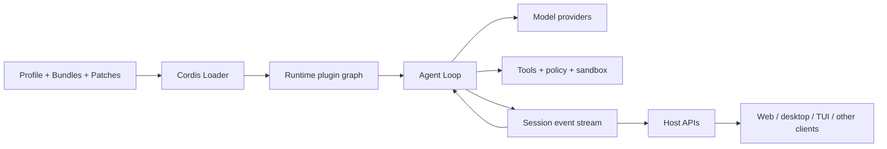

# DeepSeek Harness Guide

[English](README.md) | [简体中文](README_zh.md) | [繁體中文](README_tw.md) | [日本語](README_ja.md) | [한국어](README_ko.md) | [Deutsch](README_de.md) | [Español](README_es.md) | [Français](README_fr.md) | [Italiano](README_it.md) | [Português](README_pt.md) | [Русский](README_ru.md) | [العربية](README_ar.md) | [Bahasa Indonesia](README_id.md) | [ไทย](README_th.md) | [Tiếng Việt](README_vi.md)

> A multilingual, developer-oriented guide to understanding, running, extending, and building agents with [DeepSeek Harness](https://github.com/deepseek-ai/deepseek-harness).

DeepSeek Harness (`dsh`) is an open-source **agent runtime and composition framework** from DeepSeek AI. It connects models, prompts, tools, permissions, sandboxes, sessions, subagents, telemetry, and user interfaces into a working agent—and makes those parts replaceable through a shared plugin architecture.

This repository explains that system in practical terms. It is an independent community guide, not an official DeepSeek project.

> [!IMPORTANT]
> DeepSeek Harness is in developer preview and explicitly allows compatibility-breaking changes. Pin the DSH revision used by your project and verify commands and APIs against the [official repository](https://github.com/deepseek-ai/deepseek-harness).

## Start here

| I want to… | Read this |
|---|---|
| Understand what DSH is | [What is DeepSeek Harness?](#what-is-deepseek-harness) |
| Understand the architecture | [Architecture](#architecture) and the [technical guide](GUIDE.md) |
| Run the Web UI or SDK | [Quick start](#quick-start) and the [usage handbook](USAGE.md) |
| Build an agent on DSH | [Develop an agent with DSH](#develop-an-agent-with-dsh) |
| Build or package a plugin | [Extension model](#choose-the-right-extension) and the [official plugin tutorial](https://github.com/deepseek-ai/deepseek-harness/blob/master/docs/user/develop/basic/index.md) |
| Let a coding agent help with DSH | [Reusable Agent Skills](#reusable-agent-skills) |
| Review a third-party plugin | [Security and compatibility](#security-and-compatibility) |

## Contents

- [What is DeepSeek Harness?](#what-is-deepseek-harness)
- [Architecture](#architecture)
- [Quick start](#quick-start)
- [Develop an agent with DSH](#develop-an-agent-with-dsh)
- [Choose the right extension](#choose-the-right-extension)
- [Documentation map](#documentation-map)
- [Reusable Agent Skills](#reusable-agent-skills)
- [Security and compatibility](#security-and-compatibility)
- [flaq.ai model APIs and affiliate program](#flaqai-model-apis-and-affiliate-program)

## What is DeepSeek Harness?

A model can generate text or tool calls, but it does not by itself manage a workspace, execute tools safely, preserve a session, request approval, recover from cancellation, coordinate subagents, or expose a user interface. An **agent harness** supplies that operating layer.

DSH is useful in two related roles:

1. **A ready-to-run agent application** — start the official Web UI, configure a model, select a workspace, and run agent sessions.
2. **A framework for assembling agent products** — replace or add model providers, tools, Agent Loops, storage, sandboxes, policies, surfaces, and workflows without maintaining a full runtime fork.

Its defining idea is **Everything is a Plugin**. Built-in capabilities and third-party extensions use the same composition mechanism, powered by [Cordis](https://github.com/cordiverse/cordis). This makes DSH closer to a configurable agent runtime than to a single fixed coding assistant.

### What this project adds

The official project provides the implementation and reference contracts. This guide adds:

- a stable mental model for the fast-moving source tree;
- multilingual architecture and operating documentation;
- decision paths for Agent, tool, provider, session, and UI development;
- security and lifecycle review checklists;
- reusable Skills that help coding agents explore, scaffold, build, and review DSH extensions.

## Architecture

DSH has two cooperating structures:

- the **runtime plugin graph** defines which capabilities are available, where they are visible, and who owns their lifecycle;
- the **Session event stream** preserves the durable facts needed to reconstruct model-visible history and interface state.

The Agent Loop connects them by reading model, prompt, tool, policy, and storage capabilities from the graph, executing work, and writing results back to the Session.



### Runtime composition

| Concept | Responsibility |
|---|---|
| **Plugin** | A TypeScript function, object, or service class mounted into a Cordis Context. |
| **Context** | Controls capability visibility and resource ownership. |
| **Service** | A typed capability provided by one plugin and consumed by others through `inject`. |
| **Fiber** | One live plugin mount with its own lifecycle. |
| **Effect** | A resource registration with cleanup when its owning Fiber unloads. |
| **Event** | A typed observation or interception point between plugins. |
| **Loader** | Reconciles ordered configuration into the live plugin graph. |

### Deployment composition

| Concept | Responsibility |
|---|---|
| **Bundle** | An npm package that contributes a configuration layer through `dsh.bundle`. |
| **Profile** | A named runnable composition containing ordered Bundles and local dependencies. |
| **Patch** | A late YAML overlay that inserts or replaces configuration rows. |
| **Preset** | Session-level Agent behavior; it is not another process-level Profile. |

### Agent execution

A typical turn follows this path:

1. reconstruct model-visible context from durable Session events;
2. assemble the system prompt, tool schemas, model route, and policy state;
3. stream a model response;
4. validate, authorize, approve, and execute requested tools;
5. persist canonical results as Session events;
6. continue until the Agent Loop's completion condition is met;
7. project the same event state to Web or other clients.

For Context, Service, Fiber, Effect, Event, Session, Turn/Step, caching, and security boundaries, read the [technical architecture guide](GUIDE.md).

## Quick start

### Run the official Web UI

Install Node.js 22.19 or a 24+ release (and re-check the [official development guide](https://github.com/deepseek-ai/deepseek-harness/blob/master/docs/development.md) before deployment), then run:

```bash
npx @deepseek-ai/dsh web
```

Open `http://127.0.0.1:3080`, configure a model service in **Settings → Models**, select a workspace, and begin with a non-destructive task.

Inspect the effective plugin tree before debugging extensions:

```bash
dsh --profile web --dump-config
```

### Run from source

```bash
git clone https://github.com/deepseek-ai/deepseek-harness.git
cd deepseek-harness
pnpm install
pnpm run build
pnpm dsh web
```

Programmatic embedding is also available through the official Python SDK. See the [usage handbook](USAGE.md) for SDK setup, plugin installation, rollback, and troubleshooting.

## Develop an agent with DSH

Building an Agent usually means composing several DSH extension points, not writing one large plugin.

### 1. Define the Agent contract

Write down the target user, task boundary, allowed side effects, required data, completion condition, budget, cancellation behavior, and human-approval points. This determines which runtime capabilities are actually needed.

### 2. Choose the runtime composition

Start from a Profile close to the target host, add versioned Bundles, and keep environment-specific changes in Patches. Use a disposable Profile while developing external plugins.

### 3. Configure the model and context

Choose or implement the model provider, then define prompt assembly, workspace instructions, memory, compaction, and tool visibility. Keep stable prompt and tool-schema prefixes stable where possible so provider-side prefix caching remains useful.

### 4. Add capabilities as focused plugins

Create narrow providers and consumers:

- tools for model-requested actions;
- Services for reusable runtime capabilities;
- Events for observation and interception;
- model, filesystem, process, sandbox, storage, telemetry, or subagent providers when existing implementations do not fit.

Declare consumed Services through `inject`, and register resources through lifecycle-aware `ctx` helpers.

### 5. Shape the Agent Loop and policy

Use the existing loop when only prompts, tools, or policies change. Replace or wrap the Agent Loop only when planning, routing, validation, handoff, retry, or completion semantics genuinely differ. Keep schema validation, authorization, user approval, and OS sandboxing as separate controls.

### 6. Make state replayable

If a fact is later visible to the model or UI, persist it as a canonical Session event. Treat UI state as a projection, not the source of truth. Test cancellation, partial tool failure, restart, compaction, and replay.

### 7. Add a surface only where needed

Runtime behavior belongs in the Host. Browser presentation belongs in a Client plugin. Cross-boundary features should use a typed remote API instead of duplicating state in the UI.

### 8. Package and verify

Package distributable configuration as a Bundle, install it into a disposable Profile, inspect `--dump-config`, and test mount, normal use, denial, timeout, unload, remount, restart, removal, and rollback.

## Choose the right extension

| Goal | Prefer | Avoid confusing it with |
|---|---|---|
| Add an action the model can request | Tool plugin | An Agent Skill |
| Share a runtime capability | Service provider plugin | A global singleton outside lifecycle control |
| Change planning or completion behavior | Prompt/policy plugin first; Agent Loop when necessary | A new Profile for every behavior |
| Add a model or infrastructure backend | Provider plugin | Hard-coding it into the loop |
| Preserve memory or audit state | Session/storage plugin and durable events | UI-only state |
| Add a Web panel or result card | Client plugin plus typed Host API | Privileged browser code |
| Ship configuration and plugins | Bundle | Profile |
| Assemble an installable runtime | Profile | Runtime fork |
| Connect an independent application | Client or protocol bridge | In-process plugin |
| Guide a coding agent during development | Agent Skill | DSH runtime plugin |

Common Agent product modules include workflow and planning, tools and integrations, context and memory, sessions and replay, subagents, model routing, browser and vision, policy and sandboxing, UI surfaces, and operations/telemetry. The [usage handbook](USAGE.md) provides a categorized module map and installation checklist.

## Documentation map

| Resource | Purpose |
|---|---|
| [Technical guide](GUIDE.md) | Architecture, lifecycle, Session model, caching, and security boundaries |
| [Usage handbook](USAGE.md) | Installation, module selection, plugin/tool workflows, troubleshooting, and release checks |
| [Reusable Skills](skills/) | Agent-readable workflows for DSH development |
| [Contribution guide](CONTRIBUTING.md) | Sources, translations, review, and contribution rules |
| [Roadmap](ROADMAP.md) | Planned examples, validation, compatibility metadata, and ecosystem work |

Every README, architecture guide, and usage handbook currently has 15 language entry points.

## Reusable Agent Skills

These repository-local Skills guide compatible coding agents through common DSH work. A Skill is an instruction workflow; it is **not** installed with `dsh plugin` and does not execute inside the DSH runtime.

| Skill | Use it to… |
|---|---|
| [`dsh-repository-explorer`](skills/dsh-repository-explorer/) | Map Profiles, Bundles, Patches, packages, Services, Events, Sessions, and Host/Client ownership. |
| [`dsh-plugin-scaffold`](skills/dsh-plugin-scaffold/) | Build a narrow lifecycle-safe plugin and optional packaging. |
| [`dsh-tool-builder`](skills/dsh-tool-builder/) | Design a typed, policy-aware, bounded, and replayable tool. |
| [`dsh-plugin-review`](skills/dsh-plugin-review/) | Audit compatibility, lifecycle, supply chain, permissions, secrets, and replay risk. |

## Security and compatibility

- Pin DSH and third-party plugin revisions; preview APIs are not stable contracts.
- Inspect `dsh --profile <name> --dump-config` to verify the actual composition.
- Review dependency install and `prepare` scripts before allowing them to run.
- Treat same-process plugins, generated JavaScript, subprocesses, filesystem access, and network access as privileged behavior.
- Do not describe `inject` as a sandbox. Dependency visibility, policy, approval, and OS isolation are separate boundaries.
- Keep real credentials, private Sessions, screenshots, QR codes, and contact details out of examples and documentation.
- Treat ecosystem inclusion as discovery, not a security endorsement.

## Official and community sources

- [DeepSeek Harness official repository](https://github.com/deepseek-ai/deepseek-harness)
- [Official architecture](https://github.com/deepseek-ai/deepseek-harness/blob/master/docs/architecture.md)
- [Official first-plugin tutorial](https://github.com/deepseek-ai/deepseek-harness/blob/master/docs/user/develop/basic/index.md)
- [Official tool tutorial](https://github.com/deepseek-ai/deepseek-harness/blob/master/docs/user/develop/basic/tool.md)
- [Official packaging and installation guide](https://github.com/deepseek-ai/deepseek-harness/blob/master/docs/user/develop/basic/publish.md)
- [Cordis](https://github.com/cordiverse/cordis) and its [spatiotemporal composability paper](https://github.com/cordiverse/paper)
- [Community ecosystem classification reference](https://github.com/libukai/awesome-deepseek-harness)

## flaq.ai model APIs and affiliate program

[flaq.ai](https://flaq.ai/) is a third-party AI model aggregation and API platform. Its LLM API exposes a managed Chat Completions route with streaming examples for JavaScript, Python, and cURL. Developers evaluating model providers for a DSH-based Agent can review these DeepSeek V4 endpoints:

| API | Suggested evaluation focus |
|---|---|
| [DeepSeek V4 Pro Text-to-Text](https://flaq.ai/models/deepseek/deepseek-v4-pro-text-to-text/) | Reasoning, writing, coding assistance, analysis, and production text workflows |
| [DeepSeek V4 Flash Text-to-Text](https://flaq.ai/models/deepseek/deepseek-v4-flash-text-to-text/) | Fast, cost-conscious text generation, summaries, writing, and automation |

Before connecting any third-party endpoint to DSH, verify the current base URL, model identifier, streaming behavior, tool-calling support, pricing, data handling, rate limits, and error contract against both services' latest documentation. Inclusion here is an integration option, not an availability, performance, or compatibility guarantee.

Developers and content creators may also apply to the [flaq.ai Affiliate Program](https://flaq.ai/affiliate-agreement/). Participation is governed by the current agreement and applicable law; affiliates must make required disclosures, avoid misleading promotion, and should not assume any guaranteed traffic, commission, payout, or earnings.

## Contributing and license

Corrections, translations, examples, revision-pinned case studies, and Skills are welcome. See [CONTRIBUTING.md](CONTRIBUTING.md). This guide is available under the [MIT License](LICENSE).
