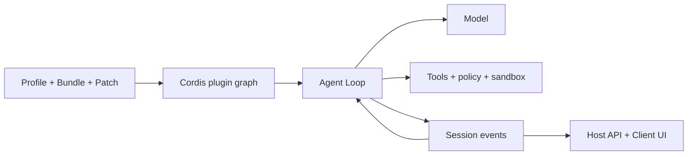

# دليل DeepSeek Harness

[English](README.md) | [简体中文](README_zh.md) | [繁體中文](README_tw.md) | [日本語](README_ja.md) | [한국어](README_ko.md) | [Deutsch](README_de.md) | [Español](README_es.md) | [Français](README_fr.md) | [Italiano](README_it.md) | [Português](README_pt.md) | [Русский](README_ru.md) | [العربية](README_ar.md) | [Bahasa Indonesia](README_id.md) | [ไทย](README_th.md) | [Tiếng Việt](README_vi.md)

> دليل متعدد اللغات للمطورين لفهم [DeepSeek Harness](https://github.com/deepseek-ai/deepseek-harness) وتشغيله وتوسيعه وبناء وكلاء مخصصين فوقه.

DeepSeek Harness أو `dsh` هو **Runtime وإطار تركيب للوكلاء** مفتوح المصدر من DeepSeek AI. يربط النماذج والتعليمات والأدوات والصلاحيات والعزل والجلسات والوكلاء الفرعيين والقياس والواجهات، ويجعل الوحدات قابلة للاستبدال عبر بنية إضافات مشتركة.

> [!IMPORTANT]
> لا يزال DSH في مرحلة المعاينة للمطورين وقد تحدث تغييرات غير متوافقة. ثبّت Git commit المستخدم وراجع [المستودع الرسمي](https://github.com/deepseek-ai/deepseek-harness). هذا دليل مجتمعي مستقل.

## نقطة البداية

| الهدف | المستند |
|---|---|
| فهم البنية | [الدليل التقني](GUIDE_ar.md) |
| التثبيت والاستخدام والتشخيص | [دليل الاستخدام](USAGE_ar.md) |
| بناء Agent فوق DSH | [مسار التطوير](#تطوير-agent-باستخدام-dsh) |
| الاستعانة بوكيل برمجي | [Skills عملية](skills/) |

## ما هو DeepSeek Harness؟

النموذج وحده لا يدير مساحة العمل ولا ينفذ الأدوات بأمان ولا يحفظ الجلسة ولا يطلب الموافقة ولا يقدم واجهة. يوفر Agent Harness طبقة التشغيل هذه. يعمل DSH كتطبيق Web Agent جاهز وكإطار لبناء وكلاء للبرمجة والبحث والعمليات والمجالات المتخصصة.

المبدأ الأساسي هو **Everything is a Plugin**. تستخدم موصلات النماذج والأدوات وAgent Loop وSession والسياسات والعزل والتخزين والواجهة نموذج Cordis نفسه للتركيب.

## البنية



- تدير Context وService وFiber وEffect وEvent وLoader الرؤية والاعتماد ودورة الحياة.
- توزع Bundle الإعدادات، ويركب Profile بيئة التشغيل، ويحفظ Patch فروق البيئة.
- يجمع Agent Loop السياق ويستدعي النموذج والأدوات ويقرر الاكتمال.
- تمثل Session Events مصدر الحقائق الدائم القابل لإعادة التشغيل، والواجهة مجرد عرض له.
- يحتوي Host على قدرات Runtime الحساسة، ويتولى Client العرض.

## البدء السريع

```bash
npx @deepseek-ai/dsh web
```

افتح `http://127.0.0.1:3080`، واضبط النموذج في **Settings → Models**، واختر مساحة العمل. افحص التركيب النهائي قبل تشخيص الإضافات:

```bash
dsh --profile web --dump-config
```

## تطوير Agent باستخدام DSH

1. عرّف المهمة والآثار المسموحة وشروط الإكمال والميزانية والإلغاء والموافقات.
2. اختر Profile وأضف القدرات عبر Bundles واحفظ فروق البيئة في Patches.
3. صمم النموذج وPrompt والذاكرة والضغط ورؤية الأدوات.
4. افصل Tools وServices وProviders والسياسات وworkflows إلى إضافات صغيرة.
5. أعد استخدام Agent Loop الحالي ولا تستبدله إلا عند اختلاف التخطيط أو الإكمال.
6. احفظ النتائج التي يحتاج النموذج أو UI لإعادتها على شكل Session Events.
7. ضع Runtime في Host والعرض في Client واربطهما عبر API معرف الأنواع.
8. اختبر mount والرفض والمهلة وunload وإعادة التشغيل والتراجع في Profile مؤقت.

الـ Tool قدرة Runtime يستدعيها النموذج، أما Agent Skill فهي تعليمات لوكيل البرمجة وليست إضافة داخل DSH Runtime.

## مستندات المشروع

- [الدليل التقني](GUIDE_ar.md): ‏Cordis ودورة الحياة وSession والتخزين المؤقت والأمان.
- [دليل الاستخدام](USAGE_ar.md): التثبيت والوحدات وتطوير الإضافات والتشخيص والنشر.
- [Skills عملية](skills/): استكشاف المصدر وبناء الإضافات والأدوات والمراجعة الأمنية.
- النسخ الكاملة: [English](README.md) و[简体中文](README_zh.md).

## الأمان والتوافق

ثبّت commits الخاصة بـ DSH والإضافات. راجع نصوص التثبيت والملفات والشبكة والعمليات الفرعية والاحتفاظ بالبيانات. حقن الاعتماد والسياسة وموافقة المستخدم وعزل نظام التشغيل حدود منفصلة. لا تضع بيانات اعتماد حقيقية أو جلسات خاصة أو صور شاشة أو رموز QR أو معلومات اتصال في المستندات.

[MIT License](LICENSE)
