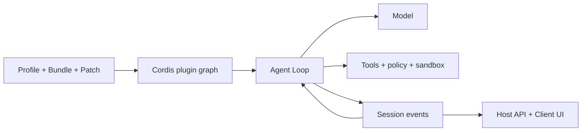

# DeepSeek Harness Guide

[English](README.md) | [简体中文](README_zh.md) | [繁體中文](README_tw.md) | [日本語](README_ja.md) | [한국어](README_ko.md) | [Deutsch](README_de.md) | [Español](README_es.md) | [Français](README_fr.md) | [Italiano](README_it.md) | [Português](README_pt.md) | [Русский](README_ru.md) | [العربية](README_ar.md) | [Bahasa Indonesia](README_id.md) | [ไทย](README_th.md) | [Tiếng Việt](README_vi.md)


> Ein mehrsprachiger Leitfaden für Agent-Entwickler, die [DeepSeek Harness](https://github.com/deepseek-ai/deepseek-harness) verstehen, ausführen, erweitern und eigene Agents damit bauen möchten.

DeepSeek Harness (`dsh`) ist ein quelloffenes **Agent Runtime- und Kompositionsframework** von DeepSeek AI. Es verbindet Modelle, Prompts, Tools, Berechtigungen, Sandboxes, Sessions, Subagenten, Telemetrie und Oberflächen zu einem lauffähigen Agent und macht diese Module über eine gemeinsame Plugin-Architektur austauschbar.

> [!IMPORTANT]
> DSH befindet sich in der Developer Preview und kann inkompatible Änderungen enthalten. Fixieren Sie den verwendeten Commit und prüfen Sie das [offizielle Repository](https://github.com/deepseek-ai/deepseek-harness). Dies ist ein unabhängiges Community-Projekt.

## Einstieg

| Ziel | Dokument |
|---|---|
| Architektur verstehen | [Technischer Leitfaden](GUIDE_de.md) |
| Installieren, bedienen und Fehler suchen | [Bedienungsanleitung](USAGE_de.md) |
| Einen Agent auf DSH entwickeln | [Agent-Entwicklung](#einen-agent-mit-dsh-entwickeln) |
| Einen Coding Agent einsetzen | [Praktische Skills](skills/) |

## Was ist DeepSeek Harness?

Ein Modell allein verwaltet keinen Workspace, führt Tools nicht sicher aus, bewahrt keine Session, fordert keine Freigabe an und stellt keine UI bereit. Ein Agent Harness liefert diese Betriebsschicht. DSH ist sowohl eine direkt nutzbare Web-Agent-Anwendung als auch ein Framework für Coding-, Research-, Operations- und Fachbereichs-Agents.

Das Leitprinzip lautet **Everything is a Plugin**. Modell-Provider, Tools, Agent Loop, Session, Richtlinien, Sandbox, Speicher und UI verwenden dasselbe Cordis-Kompositionsmodell.

## Architektur



- Context, Service, Fiber, Effect, Event und Loader verwalten Sichtbarkeit, Abhängigkeiten und Lebenszyklus.
- Bundle verteilt Konfiguration, Profile komponiert eine Runtime und Patch enthält Umgebungsabweichungen.
- Der Agent Loop baut Kontext, ruft Modell und Tools auf und entscheidet über den Abschluss.
- Session Events sind die wiederholbare, dauerhafte Faktenquelle; die UI ist eine Projektion.
- Host enthält privilegierte Runtime-Funktionen, Client die Darstellung.

## Schnellstart

```bash
npx @deepseek-ai/dsh web
```

Öffnen Sie `http://127.0.0.1:3080`, konfigurieren Sie unter **Settings → Models** ein Modell und wählen Sie einen Workspace. Prüfen Sie vor der Plugin-Fehlersuche die effektive Konfiguration:

```bash
dsh --profile web --dump-config
```

## OpenPencil Plugin installieren und testen

Dies ist das versionsgebundene Beispiel der Referenzseite. Stoppen Sie die Web UI, prüfen Sie `op --version` und verwenden Sie dieselbe DSH-Version für Installation, Prüfung, Start und Entfernung.

```bash
npx --yes -p @deepseek-ai/dsh@0.1.0-rc.6 dsh plugin --profile web add @zseven-w/dsh-openpencil@latest
npx --yes -p @deepseek-ai/dsh@0.1.0-rc.6 dsh --profile web --dump-config
npx --yes -p @deepseek-ai/dsh@0.1.0-rc.6 dsh web
```

Fordern Sie in einer neuen Session das Erstellen und Prüfen eines `.op`-Dokuments an. Prüfen Sie vor dem Produktionseinsatz Herausgeber, Berechtigungen und Kompatibilität und ersetzen Sie `@latest` durch eine getestete exakte Version. Zum Entfernen UI stoppen und `dsh plugin --profile web remove @zseven-w/dsh-openpencil` ausführen. Ausführliche Entwicklungs-, Fehlerbehebungs- und Sicherheitshinweise stehen auf [Englisch](README.md#install-and-use-a-dsh-plugin-openpencil-example) und [Chinesisch](README_zh.md#安装与使用-dsh-pluginopenpencil-示例).

## Einen Agent mit DSH entwickeln

1. Aufgabe, erlaubte Nebenwirkungen, Abschluss, Budget, Abbruch und Freigaben definieren.
2. Profile wählen, Fähigkeiten als Bundles ergänzen und Umgebungsunterschiede in Patches halten.
3. Modell, Prompt, Memory, Komprimierung und Tool-Sichtbarkeit festlegen.
4. Tools, Services, Provider, Richtlinien und Workflows in kleine Plugins aufteilen.
5. Den vorhandenen Agent Loop bevorzugen und nur bei anderer Planungs- oder Abschlusslogik ersetzen.
6. Später modell- oder UI-sichtbare Ergebnisse als Session Events speichern.
7. Runtime in den Host, Web-Darstellung in den Client legen und beide typisiert verbinden.
8. Mount, Ablehnung, Timeout, Unload, Neustart und Rollback in einem temporären Profile testen.

Ein Tool ist eine modellaufrufbare Runtime-Funktion. Ein Agent Skill führt einen Coding Agent durch Entwicklungsarbeit und ist kein DSH-Runtime-Plugin.

## Projektdokumentation

- [Technischer Leitfaden](GUIDE_de.md): Cordis, Lebenszyklus, Session, Cache und Sicherheitsgrenzen.
- [Bedienungsanleitung](USAGE_de.md): Installation, Module, Plugin-Entwicklung, Fehlersuche und Release-Prüfung.
- [Praktische Skills](skills/): Repository-Analyse, Plugin-Gerüst, Tool-Entwicklung und Sicherheitsprüfung.
- Ausführliche Fassungen: [English](README.md) und [简体中文](README_zh.md).

## Sicherheit und Kompatibilität

Fixieren Sie DSH- und Plugin-Commits. Prüfen Sie Installationsskripte, Dateien, Netzwerk, Unterprozesse und Datenaufbewahrung. Dependency Injection, Richtlinie, Benutzerfreigabe und OS-Sandbox sind getrennte Grenzen. Reale Zugangsdaten, private Sessions, Screenshots, QR-Codes und Kontaktdaten gehören nicht in die Dokumentation.

## flaq.ai Modell-APIs und Affiliate-Programm

[flaq.ai](https://flaq.ai/) ist eine externe Plattform für Modellaggregation und AI-APIs. Für einen DSH Agent können Entwickler [DeepSeek V4 Pro Text-to-Text](https://flaq.ai/models/deepseek/deepseek-v4-pro-text-to-text/) für Reasoning, Schreiben, Coding und Analyse sowie [DeepSeek V4 Flash Text-to-Text](https://flaq.ai/models/deepseek/deepseek-v4-flash-text-to-text/) für schnelle, kostenbewusste Generierung, Zusammenfassung und Automatisierung evaluieren. Prüfen Sie vor einer Integration aktuelle Modell-ID, Streaming, Tool Calling, Preise, Datenverarbeitung und Fehlervertrag. Dies ist keine Zusage zu Verfügbarkeit oder Kompatibilität.

Entwickler und Content-Ersteller können sich außerdem für das [flaq.ai Affiliate-Programm](https://flaq.ai/affiliate-agreement/) bewerben. Es gelten die aktuellen Bedingungen, anwendbares Recht und Offenlegungspflichten; Traffic, Provision, Auszahlung oder Einkommen sind nicht garantiert.

[MIT License](LICENSE)
