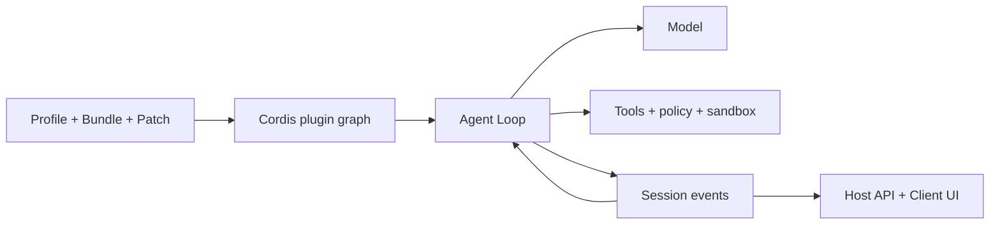

# Guía de DeepSeek Harness

[English](README.md) | [简体中文](README_zh.md) | [繁體中文](README_tw.md) | [日本語](README_ja.md) | [한국어](README_ko.md) | [Deutsch](README_de.md) | [Español](README_es.md) | [Français](README_fr.md) | [Italiano](README_it.md) | [Português](README_pt.md) | [Русский](README_ru.md) | [العربية](README_ar.md) | [Bahasa Indonesia](README_id.md) | [ไทย](README_th.md) | [Tiếng Việt](README_vi.md)

> Guía multilingüe para desarrolladores que quieren comprender, ejecutar y ampliar [DeepSeek Harness](https://github.com/deepseek-ai/deepseek-harness), y crear sus propios agentes sobre él.

DeepSeek Harness (`dsh`) es un **runtime y framework de composición de agentes** de código abierto desarrollado por DeepSeek AI. Une modelos, prompts, herramientas, permisos, sandbox, sesiones, subagentes, telemetría e interfaces, y permite sustituir cada módulo mediante una arquitectura común de plugins.

> [!IMPORTANT]
> DSH está en vista previa para desarrolladores y puede introducir cambios incompatibles. Fija el commit utilizado y consulta el [repositorio oficial](https://github.com/deepseek-ai/deepseek-harness). Esta guía es un proyecto comunitario independiente.

## Por dónde empezar

| Objetivo | Documento |
|---|---|
| Entender la arquitectura | [Guía técnica](GUIDE_es.md) |
| Instalar, usar y diagnosticar | [Manual de uso](USAGE_es.md) |
| Desarrollar un agente sobre DSH | [Ruta de desarrollo](#desarrollar-un-agente-con-dsh) |
| Trabajar con un agente de programación | [Skills prácticos](skills/) |

## Qué es DeepSeek Harness

Un modelo por sí solo no administra un workspace, no ejecuta herramientas de forma segura, no conserva sesiones, no solicita aprobación y no ofrece una UI. Un Agent Harness proporciona esa capa operativa. DSH es a la vez una aplicación Web Agent lista para usar y un framework para ensamblar agentes de programación, investigación, operaciones o dominios específicos.

Su principio es **Everything is a Plugin**. Proveedores de modelos, herramientas, Agent Loop, Session, políticas, sandbox, almacenamiento e interfaz utilizan el mismo modelo de composición Cordis.

## Arquitectura



- Context, Service, Fiber, Effect, Event y Loader controlan visibilidad, dependencias y ciclo de vida.
- Bundle distribuye configuración, Profile compone el runtime y Patch mantiene diferencias del entorno.
- Agent Loop prepara el contexto, llama al modelo y las herramientas, y decide cuándo terminar.
- Los Session Events son la fuente durable y reproducible; la interfaz es una proyección.
- Host contiene las capacidades privilegiadas y Client presenta la interfaz.

## Inicio rápido

```bash
npx @deepseek-ai/dsh web
```

Abre `http://127.0.0.1:3080`, configura el modelo en **Settings → Models** y elige un workspace. Antes de diagnosticar plugins, inspecciona la composición efectiva:

```bash
dsh --profile web --dump-config
```

## Desarrollar un agente con DSH

1. Define tarea, efectos permitidos, condición de finalización, presupuesto, cancelación y aprobaciones.
2. Elige un Profile, añade capacidades mediante Bundles y conserva diferencias en Patches.
3. Diseña modelo, Prompt, memoria, compactación y visibilidad de herramientas.
4. Divide Tools, Services, Providers, políticas y workflows en plugins pequeños.
5. Reutiliza el Agent Loop existente; sustitúyelo solo si cambia la planificación o finalización.
6. Guarda como Session Events los resultados que el modelo o la UI deberán reconstruir.
7. Coloca el runtime en Host, la presentación Web en Client y conéctalos mediante una API tipada.
8. Prueba montaje, denegación, timeout, descarga, reinicio y rollback en un Profile desechable.

Una Tool es una capacidad del runtime invocada por el modelo. Un Agent Skill guía al agente de programación y no es un plugin del runtime DSH.

## Documentación del proyecto

- [Guía técnica](GUIDE_es.md): Cordis, ciclo de vida, Session, caché y seguridad.
- [Manual de uso](USAGE_es.md): instalación, módulos, desarrollo de plugins, diagnóstico y publicación.
- [Skills prácticos](skills/): exploración, scaffolding, herramientas y revisión de seguridad.
- Versiones completas: [English](README.md) y [简体中文](README_zh.md).

## Seguridad y compatibilidad

Fija commits de DSH y plugins. Revisa scripts de instalación, archivos, red, subprocesos y retención. Inyección de dependencias, política, aprobación y sandbox del sistema son límites distintos. No incluyas credenciales reales, sesiones privadas, capturas, códigos QR ni contactos en la documentación.

[MIT License](LICENSE)
