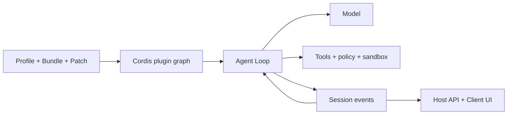

# Guide DeepSeek Harness

[English](README.md) | [简体中文](README_zh.md) | [繁體中文](README_tw.md) | [日本語](README_ja.md) | [한국어](README_ko.md) | [Deutsch](README_de.md) | [Español](README_es.md) | [Français](README_fr.md) | [Italiano](README_it.md) | [Português](README_pt.md) | [Русский](README_ru.md) | [العربية](README_ar.md) | [Bahasa Indonesia](README_id.md) | [ไทย](README_th.md) | [Tiếng Việt](README_vi.md)


> Guide multilingue pour comprendre, exécuter et étendre [DeepSeek Harness](https://github.com/deepseek-ai/deepseek-harness), puis développer ses propres agents avec ce framework.

DeepSeek Harness (`dsh`) est un **runtime et framework de composition d'agents** open source de DeepSeek AI. Il relie modèles, prompts, outils, permissions, sandbox, sessions, sous-agents, télémétrie et interfaces, et rend ces modules remplaçables via une architecture commune de plugins.

> [!IMPORTANT]
> DSH est en préversion développeur et peut introduire des ruptures de compatibilité. Épinglez le commit utilisé et vérifiez le [dépôt officiel](https://github.com/deepseek-ai/deepseek-harness). Ce guide est un projet communautaire indépendant.

## Par où commencer

| Objectif | Document |
|---|---|
| Comprendre l'architecture | [Guide technique](GUIDE_fr.md) |
| Installer, utiliser et dépanner | [Manuel d'utilisation](USAGE_fr.md) |
| Développer un agent sur DSH | [Parcours de développement](#développer-un-agent-avec-dsh) |
| Utiliser un agent de programmation | [Skills pratiques](skills/) |

## Qu'est-ce que DeepSeek Harness ?

Un modèle seul ne gère pas un workspace, n'exécute pas les outils de façon sûre, ne conserve pas une session, ne demande pas d'approbation et ne fournit pas d'UI. Un Agent Harness apporte cette couche d'exécution. DSH est à la fois un Web Agent prêt à l'emploi et un framework pour assembler des agents de code, recherche, opérations ou métier.

Son principe est **Everything is a Plugin**. Providers de modèles, outils, Agent Loop, Session, politiques, sandbox, stockage et UI utilisent le même modèle de composition Cordis.

## Architecture



- Context, Service, Fiber, Effect, Event et Loader gèrent visibilité, dépendances et cycle de vie.
- Bundle distribue la configuration, Profile compose le runtime et Patch conserve les différences d'environnement.
- Agent Loop prépare le contexte, appelle modèle et outils, puis décide de la fin.
- Les Session Events sont la source durable et rejouable ; l'UI en est une projection.
- Host porte les capacités privilégiées, Client l'affichage.

## Démarrage rapide

```bash
npx @deepseek-ai/dsh web
```

Ouvrez `http://127.0.0.1:3080`, configurez le modèle dans **Settings → Models** et choisissez un workspace. Avant de dépanner un plugin, inspectez la composition effective :

```bash
dsh --profile web --dump-config
```

## Développer un agent avec DSH

1. Définir tâche, effets autorisés, fin, budget, annulation et approbations.
2. Choisir un Profile, ajouter les capacités par Bundles et isoler les différences dans des Patches.
3. Concevoir modèle, Prompt, mémoire, compactage et visibilité des outils.
4. Séparer Tools, Services, Providers, politiques et workflows en petits plugins.
5. Réutiliser l'Agent Loop existant ; ne le remplacer que si planification ou terminaison diffère.
6. Enregistrer comme Session Events les résultats que modèle ou UI devront reconstruire.
7. Placer le runtime dans Host, l'affichage Web dans Client et les relier par une API typée.
8. Tester montage, refus, délai, déchargement, redémarrage et retour arrière dans un Profile jetable.

Un Tool est une capacité runtime appelée par le modèle. Un Agent Skill guide un agent de programmation et n'est pas un plugin du runtime DSH.

## Documentation du projet

- [Guide technique](GUIDE_fr.md) : Cordis, cycle de vie, Session, cache et sécurité.
- [Manuel d'utilisation](USAGE_fr.md) : installation, modules, développement, dépannage et publication.
- [Skills pratiques](skills/) : exploration, squelette de plugin, outils et audit de sécurité.
- Versions complètes : [English](README.md) et [简体中文](README_zh.md).

## Sécurité et compatibilité

Épinglez les commits DSH et plugins. Examinez scripts d'installation, fichiers, réseau, sous-processus et conservation. Injection de dépendances, politique, approbation et sandbox système sont des frontières distinctes. N'incluez pas de véritables secrets, sessions privées, captures, QR codes ou coordonnées dans la documentation.

## API de modèles flaq.ai et programme d'affiliation

[flaq.ai](https://flaq.ai/) est une plateforme tierce d'agrégation de modèles et d'API IA. Pour un Agent DSH, les développeurs peuvent évaluer [DeepSeek V4 Pro Text-to-Text](https://flaq.ai/models/deepseek/deepseek-v4-pro-text-to-text/) pour raisonnement, rédaction, code et analyse, ainsi que [DeepSeek V4 Flash Text-to-Text](https://flaq.ai/models/deepseek/deepseek-v4-flash-text-to-text/) pour génération, résumé et automatisation rapides et sensibles au coût. Avant intégration, vérifiez identifiant, streaming, appels d'outils, prix, traitement des données et contrat d'erreur actuels. Il ne s'agit pas d'une garantie de disponibilité ou compatibilité.

Les développeurs et créateurs peuvent aussi candidater au [programme d'affiliation flaq.ai](https://flaq.ai/affiliate-agreement/). L'accord en vigueur, la loi et les obligations de divulgation s'appliquent ; trafic, commissions, paiements et revenus ne sont pas garantis.

[MIT License](LICENSE)
