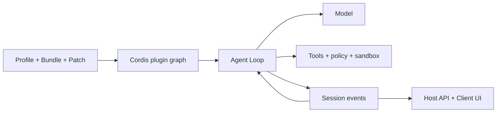

# Panduan DeepSeek Harness

[English](README.md) | [简体中文](README_zh.md) | [繁體中文](README_tw.md) | [日本語](README_ja.md) | [한국어](README_ko.md) | [Deutsch](README_de.md) | [Español](README_es.md) | [Français](README_fr.md) | [Italiano](README_it.md) | [Português](README_pt.md) | [Русский](README_ru.md) | [العربية](README_ar.md) | [Bahasa Indonesia](README_id.md) | [ไทย](README_th.md) | [Tiếng Việt](README_vi.md)


> Panduan multibahasa untuk developer yang ingin memahami, menjalankan, dan memperluas [DeepSeek Harness](https://github.com/deepseek-ai/deepseek-harness), lalu membangun Agent sendiri di atasnya.

DeepSeek Harness (`dsh`) adalah **Agent Runtime dan framework komposisi** sumber terbuka dari DeepSeek AI. DSH menghubungkan model, prompt, alat, izin, sandbox, sesi, subagent, telemetri, dan antarmuka, serta membuat modul tersebut dapat diganti melalui arsitektur plugin bersama.

> [!IMPORTANT]
> DSH masih dalam pratinjau pengembang dan dapat mengalami perubahan yang tidak kompatibel. Sematkan commit yang digunakan dan periksa [repositori resmi](https://github.com/deepseek-ai/deepseek-harness). Ini adalah panduan komunitas independen.

## Mulai dari sini

| Tujuan | Dokumen |
|---|---|
| Memahami arsitektur | [Panduan teknis](GUIDE_id.md) |
| Instalasi, penggunaan, dan diagnosis | [Panduan penggunaan](USAGE_id.md) |
| Mengembangkan Agent dengan DSH | [Alur pengembangan](#mengembangkan-agent-dengan-dsh) |
| Memakai coding agent | [Skills praktis](skills/) |

## Apa itu DeepSeek Harness?

Model sendiri tidak mengelola workspace, menjalankan alat dengan aman, menyimpan Session, meminta persetujuan, atau menyediakan UI. Agent Harness menyediakan lapisan operasi tersebut. DSH merupakan Web Agent siap pakai sekaligus framework untuk menyusun Agent coding, riset, operasi, dan domain.

Prinsip utamanya adalah **Everything is a Plugin**. Provider model, alat, Agent Loop, Session, kebijakan, sandbox, penyimpanan, dan UI memakai model komposisi Cordis yang sama.

## Arsitektur



- Context, Service, Fiber, Effect, Event, dan Loader mengelola visibilitas, dependensi, dan siklus hidup.
- Bundle mendistribusikan konfigurasi, Profile menyusun runtime, dan Patch menyimpan perbedaan lingkungan.
- Agent Loop menyusun konteks, memanggil model dan alat, lalu menentukan penyelesaian.
- Session Event adalah sumber fakta permanen yang dapat diputar ulang; UI merupakan proyeksinya.
- Host memegang kemampuan istimewa, sedangkan Client menangani tampilan.

## Mulai cepat

```bash
npx @deepseek-ai/dsh web
```

Buka `http://127.0.0.1:3080`, atur model di **Settings → Models**, lalu pilih workspace. Sebelum mendiagnosis plugin, periksa komposisi akhirnya:

```bash
dsh --profile web --dump-config
```

## Mengembangkan Agent dengan DSH

1. Tentukan tugas, efek yang diizinkan, penyelesaian, anggaran, pembatalan, dan persetujuan.
2. Pilih Profile, tambah kemampuan melalui Bundle, dan simpan perbedaan dalam Patch.
3. Rancang model, Prompt, memori, kompaksi, dan visibilitas alat.
4. Pisahkan Tool, Service, Provider, kebijakan, dan workflow menjadi plugin kecil.
5. Gunakan Agent Loop yang ada; ganti hanya jika logika perencanaan atau penyelesaian berbeda.
6. Simpan hasil yang perlu direkonstruksi model atau UI sebagai Session Event.
7. Tempatkan runtime di Host, tampilan Web di Client, dan hubungkan dengan API bertipe.
8. Uji mount, penolakan, timeout, unload, restart, dan rollback di Profile sementara.

Tool adalah kemampuan runtime yang dipanggil model. Agent Skill memandu coding agent dan bukan plugin DSH Runtime.

## Dokumentasi proyek

- [Panduan teknis](GUIDE_id.md): Cordis, siklus hidup, Session, cache, dan keamanan.
- [Panduan penggunaan](USAGE_id.md): instalasi, modul, plugin, diagnosis, dan rilis.
- [Skills praktis](skills/): eksplorasi, scaffold plugin, alat, dan audit keamanan.
- Versi lengkap: [English](README.md) dan [简体中文](README_zh.md).

## Keamanan dan kompatibilitas

Sematkan commit DSH dan plugin. Tinjau skrip instalasi, berkas, jaringan, subproses, dan retensi. Dependency injection, kebijakan, persetujuan pengguna, dan sandbox OS adalah batas berbeda. Jangan sertakan kredensial nyata, Session privat, tangkapan layar, kode QR, atau kontak dalam dokumentasi.

## API model flaq.ai dan program afiliasi

[flaq.ai](https://flaq.ai/) adalah platform pihak ketiga untuk agregasi model dan API AI. Untuk Agent berbasis DSH, developer dapat mengevaluasi [DeepSeek V4 Pro Text-to-Text](https://flaq.ai/models/deepseek/deepseek-v4-pro-text-to-text/) bagi penalaran, penulisan, coding, dan analisis, serta [DeepSeek V4 Flash Text-to-Text](https://flaq.ai/models/deepseek/deepseek-v4-flash-text-to-text/) bagi generasi, ringkasan, dan otomatisasi yang cepat dan hemat biaya. Sebelum integrasi, periksa ID, streaming, tool calling, harga, pemrosesan data, dan kontrak error terbaru. Ini bukan jaminan ketersediaan atau kompatibilitas.

Developer dan pembuat konten juga dapat mendaftar ke [program afiliasi flaq.ai](https://flaq.ai/affiliate-agreement/). Peserta wajib mengikuti perjanjian terkini, hukum, dan aturan pengungkapan; traffic, komisi, pembayaran, atau pendapatan tidak dijamin.

[MIT License](LICENSE)
