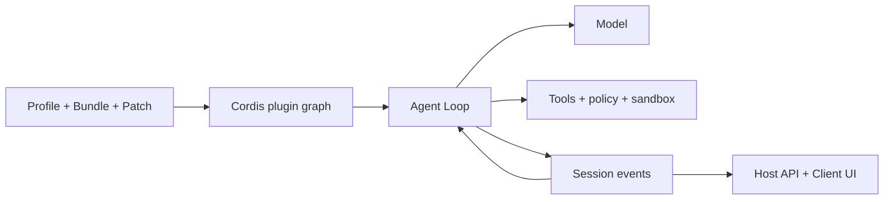

# Guida a DeepSeek Harness

[English](README.md) | [简体中文](README_zh.md) | [繁體中文](README_tw.md) | [日本語](README_ja.md) | [한국어](README_ko.md) | [Deutsch](README_de.md) | [Español](README_es.md) | [Français](README_fr.md) | [Italiano](README_it.md) | [Português](README_pt.md) | [Русский](README_ru.md) | [العربية](README_ar.md) | [Bahasa Indonesia](README_id.md) | [ไทย](README_th.md) | [Tiếng Việt](README_vi.md)


> Guida multilingue per sviluppatori che vogliono comprendere, eseguire ed estendere [DeepSeek Harness](https://github.com/deepseek-ai/deepseek-harness), costruendo Agent personalizzati.

DeepSeek Harness (`dsh`) è un **runtime e framework di composizione per Agent** open source di DeepSeek AI. Collega modelli, prompt, strumenti, permessi, sandbox, sessioni, sotto-agent, telemetria e interfacce, rendendo ogni modulo sostituibile tramite un'architettura comune di plugin.

> [!IMPORTANT]
> DSH è in anteprima per sviluppatori e può introdurre modifiche incompatibili. Fissa il commit usato e verifica il [repository ufficiale](https://github.com/deepseek-ai/deepseek-harness). Questa è una guida comunitaria indipendente.

## Da dove iniziare

| Obiettivo | Documento |
|---|---|
| Capire l'architettura | [Guida tecnica](GUIDE_it.md) |
| Installare, usare e diagnosticare | [Manuale d'uso](USAGE_it.md) |
| Sviluppare un Agent su DSH | [Percorso di sviluppo](#sviluppare-un-agent-con-dsh) |
| Usare un coding agent | [Skill pratici](skills/) |

## Cos'è DeepSeek Harness

Un modello da solo non gestisce un workspace, non esegue strumenti in sicurezza, non conserva sessioni, non chiede approvazioni e non fornisce una UI. Un Agent Harness offre questo livello operativo. DSH è sia un Web Agent pronto all'uso sia un framework per assemblare Agent di coding, ricerca, operazioni o dominio.

Il principio è **Everything is a Plugin**. Provider di modelli, strumenti, Agent Loop, Session, policy, sandbox, storage e UI usano lo stesso modello di composizione Cordis.

## Architettura



- Context, Service, Fiber, Effect, Event e Loader gestiscono visibilità, dipendenze e ciclo di vita.
- Bundle distribuisce configurazione, Profile compone il runtime e Patch mantiene differenze ambientali.
- Agent Loop prepara il contesto, chiama modello e strumenti e decide il completamento.
- I Session Event sono la fonte durevole e riproducibile; la UI è una proiezione.
- Host contiene capacità privilegiate, Client la presentazione.

## Avvio rapido

```bash
npx @deepseek-ai/dsh web
```

Apri `http://127.0.0.1:3080`, configura il modello in **Settings → Models** e scegli un workspace. Prima di diagnosticare plugin, controlla la composizione effettiva:

```bash
dsh --profile web --dump-config
```

## Sviluppare un Agent con DSH

1. Definire attività, effetti consentiti, completamento, budget, annullamento e approvazioni.
2. Scegliere un Profile, aggiungere capacità con Bundle e mantenere differenze nei Patch.
3. Progettare modello, Prompt, memoria, compattazione e visibilità degli strumenti.
4. Separare Tool, Service, Provider, policy e workflow in plugin piccoli.
5. Riutilizzare l'Agent Loop esistente; sostituirlo solo se pianificazione o completamento cambiano.
6. Salvare come Session Event i risultati che modello o UI dovranno ricostruire.
7. Tenere il runtime in Host, la UI Web in Client e collegarli con un'API tipizzata.
8. Testare mount, rifiuto, timeout, unload, riavvio e rollback in un Profile temporaneo.

Un Tool è una capacità runtime chiamata dal modello. Un Agent Skill guida un coding agent e non è un plugin runtime DSH.

## Documentazione del progetto

- [Guida tecnica](GUIDE_it.md): Cordis, ciclo di vita, Session, cache e sicurezza.
- [Manuale d'uso](USAGE_it.md): installazione, moduli, sviluppo, diagnosi e pubblicazione.
- [Skill pratici](skills/): esplorazione, scaffold plugin, sviluppo strumenti e audit.
- Versioni complete: [English](README.md) e [简体中文](README_zh.md).

## Sicurezza e compatibilità

Fissa i commit di DSH e plugin. Controlla script di installazione, file, rete, subprocessi e conservazione. Dependency injection, policy, approvazione e sandbox del sistema sono confini distinti. Non inserire credenziali reali, sessioni private, screenshot, codici QR o contatti nella documentazione.

## API dei modelli flaq.ai e programma affiliati

[flaq.ai](https://flaq.ai/) è una piattaforma esterna di aggregazione di modelli e API AI. Per un Agent DSH si possono valutare [DeepSeek V4 Pro Text-to-Text](https://flaq.ai/models/deepseek/deepseek-v4-pro-text-to-text/) per ragionamento, scrittura, codice e analisi, e [DeepSeek V4 Flash Text-to-Text](https://flaq.ai/models/deepseek/deepseek-v4-flash-text-to-text/) per generazione, sintesi e automazione rapide e attente ai costi. Prima dell'integrazione verifica ID modello, streaming, tool calling, prezzi, trattamento dati e contratto errori aggiornati. Non è una garanzia di disponibilità o compatibilità.

Sviluppatori e creator possono candidarsi al [programma affiliati flaq.ai](https://flaq.ai/affiliate-agreement/). Si applicano l'accordo corrente, le leggi e gli obblighi di trasparenza; traffico, commissioni, pagamenti o guadagni non sono garantiti.

[MIT License](LICENSE)
