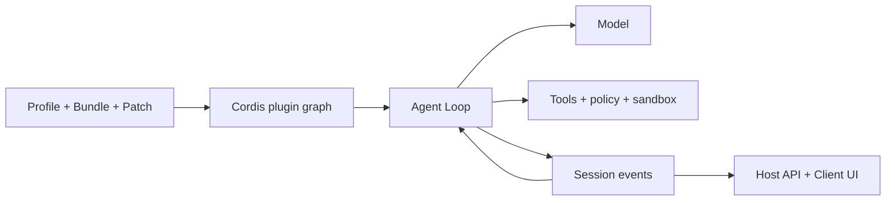

# DeepSeek Harness ガイド

[English](README.md) | [简体中文](README_zh.md) | [繁體中文](README_tw.md) | [日本語](README_ja.md) | [한국어](README_ko.md) | [Deutsch](README_de.md) | [Español](README_es.md) | [Français](README_fr.md) | [Italiano](README_it.md) | [Português](README_pt.md) | [Русский](README_ru.md) | [العربية](README_ar.md) | [Bahasa Indonesia](README_id.md) | [ไทย](README_th.md) | [Tiếng Việt](README_vi.md)


> Agent 開発者が [DeepSeek Harness](https://github.com/deepseek-ai/deepseek-harness) を理解・実行・拡張し、独自 Agent を構築するための多言語ガイドです。

DeepSeek Harness（`dsh`）は DeepSeek AI が公開した **Agent Runtime と構成フレームワーク**です。モデル、Prompt、ツール、権限、サンドボックス、Session、Subagent、テレメトリー、UI を動作する Agent にまとめ、共通のプラグイン方式で交換可能にします。

> [!IMPORTANT]
> DSH は開発者プレビュー中で、互換性を壊す変更があり得ます。使用するコミットを固定し、[公式リポジトリ](https://github.com/deepseek-ai/deepseek-harness)を基準にしてください。本ガイドは独立したコミュニティプロジェクトです。

## 入口

| 目的 | ガイド |
|---|---|
| アーキテクチャを理解する | [技術ガイド](GUIDE_ja.md) |
| 導入・運用・トラブルシュート | [利用ガイド](USAGE_ja.md) |
| DSH 上で Agent を開発する | [Agent 開発手順](#dsh-で-agent-を開発する) |
| Coding Agent に開発を支援させる | [実用 Skills](skills/) |

## DeepSeek Harness とは

モデル単体では、Workspace 管理、安全なツール実行、Session 保存、承認、キャンセル、Subagent、UI を処理できません。Agent Harness がこの実行層を提供します。DSH はすぐ使える Web Agent であると同時に、コーディング、調査、運用、業務 Agent を組み立てるフレームワークです。

中心思想は **Everything is a Plugin**。モデル Provider、ツール、Agent Loop、Session、ポリシー、サンドボックス、ストレージ、UI が Cordis の同じ構成モデルを使います。

## アーキテクチャ



- Context、Service、Fiber、Effect、Event、Loader が可視性、依存関係、ライフサイクルを管理します。
- Bundle は設定を配布し、Profile は実行環境を構成し、Patch は環境差分を上書きします。
- Agent Loop はコンテキストを組み立て、モデルとツールを呼び、完了を判断します。
- Session Event は再生可能な永続的事実で、UI はその投影です。
- Host は高権限の Runtime、Client は表示を担当します。

## クイックスタート

```bash
npx @deepseek-ai/dsh web
```

`http://127.0.0.1:3080` を開き、**Settings → Models** でモデルを設定して Workspace を選びます。プラグイン調査の前に構成を確認します。

```bash
dsh --profile web --dump-config
```

## OpenPencil Plugin のインストールとテスト

以下は参照ページで固定されたバージョンの例です。Web UI を停止し、`op --version` が成功することを確認してから、インストール、確認、起動、削除まで同じ DSH バージョンを使用します。

```bash
npx --yes -p @deepseek-ai/dsh@0.1.0-rc.6 dsh plugin --profile web add @zseven-w/dsh-openpencil@latest
npx --yes -p @deepseek-ai/dsh@0.1.0-rc.6 dsh --profile web --dump-config
npx --yes -p @deepseek-ai/dsh@0.1.0-rc.6 dsh web
```

新しい Session で `.op` ドキュメントの作成と検査を依頼します。本番利用前に配布元、権限、互換性を確認し、`@latest` を検証済みの正確なバージョンに置き換えてください。削除時は UI を停止し、`dsh plugin --profile web remove @zseven-w/dsh-openpencil` を実行します。開発、トラブルシューティング、安全性の詳細は[英語版](README.md#install-and-use-a-dsh-plugin-openpencil-example)または[中国語版](README_zh.md#安装与使用-dsh-pluginopenpencil-示例)を参照してください。

## DSH で Agent を開発する

1. タスク範囲、副作用、完了条件、予算、キャンセル、承認点を定義します。
2. Profile を選び、Bundle で能力を追加し、環境差分を Patch に置きます。
3. モデル、Prompt、Memory、Compaction、ツール可視性を設計します。
4. Tool、Service、Provider、Policy、Workflow を小さなプラグインに分けます。
5. 既存 Agent Loop を優先し、計画や完了の意味が異なる場合だけ置換します。
6. モデルや UI が後で参照する結果を Session Event に保存します。
7. Runtime は Host、Web 表示は Client に置き、型付き API で接続します。
8. 使い捨て Profile で mount、deny、timeout、unload、restart、rollback を検証します。

Tool はモデルが呼ぶ Runtime 能力です。Agent Skill は Coding Agent を案内する手順であり、同じものではありません。

## プロジェクト資料

- [技術ガイド](GUIDE_ja.md)：Cordis、ライフサイクル、Session、キャッシュ、安全境界。
- [利用ガイド](USAGE_ja.md)：導入、モジュール分類、プラグイン開発、障害対応、公開確認。
- [実用 Skills](skills/)：ソース探索、プラグイン作成、ツール開発、セキュリティレビュー。
- 詳細は [English](README.md) または [简体中文](README_zh.md) の完全版を参照してください。

## セキュリティと互換性

DSH とプラグインのコミットを固定し、インストールスクリプト、ファイル、ネットワーク、子プロセス、データ保持を確認してください。Dependency Injection、Policy、ユーザー承認、OS Sandbox は別の境界です。実際の認証情報、非公開 Session、スクリーンショット、QR コード、連絡先を文書に含めません。

## flaq.ai モデル API とアフィリエイトプログラム

[flaq.ai](https://flaq.ai/) は第三者の AI モデル集約・API プラットフォームです。DSH Agent のモデル候補として、推論・文章・コーディング・分析向けの [DeepSeek V4 Pro Text-to-Text](https://flaq.ai/models/deepseek/deepseek-v4-pro-text-to-text/) と、高速でコストを重視した生成・要約・自動化向けの [DeepSeek V4 Flash Text-to-Text](https://flaq.ai/models/deepseek/deepseek-v4-flash-text-to-text/) を評価できます。接続前に最新のモデル ID、Streaming、Tool Calling、料金、データ処理、エラー契約を確認してください。利用可能性や互換性を保証する記載ではありません。

開発者やコンテンツ制作者は [flaq.ai Affiliate Program](https://flaq.ai/affiliate-agreement/) に申請できます。最新規約、適用法、開示義務に従い、トラフィック、報酬、支払い、収益を保証する表現は避けてください。

[MIT License](LICENSE)
