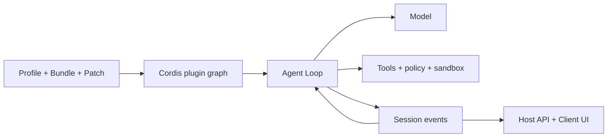

# DeepSeek Harness 가이드

[English](README.md) | [简体中文](README_zh.md) | [繁體中文](README_tw.md) | [日本語](README_ja.md) | [한국어](README_ko.md) | [Deutsch](README_de.md) | [Español](README_es.md) | [Français](README_fr.md) | [Italiano](README_it.md) | [Português](README_pt.md) | [Русский](README_ru.md) | [العربية](README_ar.md) | [Bahasa Indonesia](README_id.md) | [ไทย](README_th.md) | [Tiếng Việt](README_vi.md)

> Agent 개발자가 [DeepSeek Harness](https://github.com/deepseek-ai/deepseek-harness)를 이해하고 실행·확장하여 자신만의 Agent를 만들기 위한 다국어 가이드입니다.

DeepSeek Harness(`dsh`)는 DeepSeek AI의 오픈 소스 **Agent Runtime 및 조합 프레임워크**입니다. 모델, Prompt, 도구, 권한, 샌드박스, Session, Subagent, 텔레메트리, UI를 실행 가능한 Agent로 연결하고 공통 플러그인 아키텍처로 교체할 수 있게 합니다.

> [!IMPORTANT]
> DSH는 개발자 프리뷰 단계이며 호환성을 깨는 변경이 생길 수 있습니다. 사용하는 커밋을 고정하고 [공식 저장소](https://github.com/deepseek-ai/deepseek-harness)를 기준으로 확인하세요. 이 문서는 독립 커뮤니티 프로젝트입니다.

## 빠른 안내

| 목표 | 문서 |
|---|---|
| 아키텍처 이해 | [기술 가이드](GUIDE_ko.md) |
| 설치, 사용, 문제 해결 | [사용 안내서](USAGE_ko.md) |
| DSH 기반 Agent 개발 | [Agent 개발 절차](#dsh로-agent-개발하기) |
| Coding Agent 활용 | [실용 Skills](skills/) |

## DeepSeek Harness란

모델만으로는 Workspace 관리, 안전한 도구 실행, Session 저장, 사용자 승인, 취소, Subagent, UI를 처리할 수 없습니다. Agent Harness가 이 실행 계층을 제공합니다. DSH는 바로 실행할 수 있는 Web Agent이면서 코딩, 연구, 운영, 도메인 Agent를 조립하는 프레임워크입니다.

핵심 철학은 **Everything is a Plugin**입니다. 모델 Provider, 도구, Agent Loop, Session, Policy, Sandbox, Storage, UI가 Cordis의 동일한 조합 모델을 사용합니다.

## 아키텍처



- Context, Service, Fiber, Effect, Event, Loader가 가시성, 의존성, 수명 주기를 관리합니다.
- Bundle은 구성을 배포하고 Profile은 실행 환경을 조립하며 Patch는 환경 차이를 덮어씁니다.
- Agent Loop는 컨텍스트를 만들고 모델과 도구를 호출하며 완료 여부를 판단합니다.
- Session Event는 재생 가능한 영구 사실이며 UI는 그 투영입니다.
- Host는 권한이 필요한 Runtime을, Client는 화면 표시를 담당합니다.

## 빠른 시작

```bash
npx @deepseek-ai/dsh web
```

`http://127.0.0.1:3080`을 열고 **Settings → Models**에서 모델을 설정한 뒤 Workspace를 선택합니다. 플러그인 문제를 보기 전에 최종 구성을 확인하세요.

```bash
dsh --profile web --dump-config
```

## DSH로 Agent 개발하기

1. 작업 범위, 부작용, 완료 조건, 예산, 취소, 승인 지점을 정의합니다.
2. Profile을 선택하고 Bundle로 기능을 추가하며 환경 차이는 Patch에 둡니다.
3. 모델, Prompt, Memory, Compaction, 도구 가시성을 설계합니다.
4. Tool, Service, Provider, Policy, Workflow를 작은 플러그인으로 분리합니다.
5. 기존 Agent Loop를 우선 사용하고 계획·완료 의미가 다를 때만 교체합니다.
6. 모델이나 UI가 나중에 볼 결과를 Session Event로 저장합니다.
7. Runtime은 Host, Web 표현은 Client에 두고 타입이 있는 API로 연결합니다.
8. 일회용 Profile에서 mount, deny, timeout, unload, restart, rollback을 검증합니다.

Tool은 모델이 호출하는 Runtime 기능입니다. Agent Skill은 Coding Agent의 개발 절차이며 DSH Runtime 플러그인이 아닙니다.

## 프로젝트 문서

- [기술 가이드](GUIDE_ko.md): Cordis, 수명 주기, Session, 캐시, 보안 경계.
- [사용 안내서](USAGE_ko.md): 설치, 모듈 분류, 플러그인 개발, 문제 해결, 배포 검사.
- [실용 Skills](skills/): 저장소 탐색, 플러그인 스캐폴드, 도구 개발, 보안 검토.
- 전체 설명은 [English](README.md) 또는 [简体中文](README_zh.md)을 참고하세요.

## 보안과 호환성

DSH와 플러그인 커밋을 고정하고 설치 스크립트, 파일, 네트워크, 하위 프로세스, 데이터 보존을 검토하세요. 의존성 주입, Policy, 사용자 승인, OS Sandbox는 별도 경계입니다. 실제 자격 증명, 비공개 Session, 스크린샷, QR 코드, 연락처를 문서에 포함하지 않습니다.

[MIT License](LICENSE)
