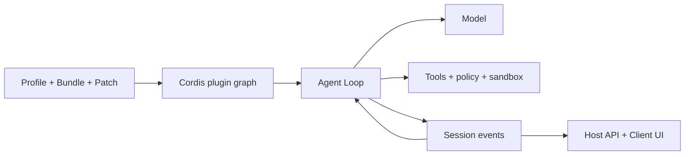

# Guia do DeepSeek Harness

[English](README.md) | [简体中文](README_zh.md) | [繁體中文](README_tw.md) | [日本語](README_ja.md) | [한국어](README_ko.md) | [Deutsch](README_de.md) | [Español](README_es.md) | [Français](README_fr.md) | [Italiano](README_it.md) | [Português](README_pt.md) | [Русский](README_ru.md) | [العربية](README_ar.md) | [Bahasa Indonesia](README_id.md) | [ไทย](README_th.md) | [Tiếng Việt](README_vi.md)


> Guia multilíngue para desenvolvedores entenderem, executarem e ampliarem o [DeepSeek Harness](https://github.com/deepseek-ai/deepseek-harness), criando seus próprios Agents.

DeepSeek Harness (`dsh`) é um **runtime e framework de composição de Agents** open source da DeepSeek AI. Ele conecta modelos, prompts, ferramentas, permissões, sandbox, sessões, subagents, telemetria e interfaces, tornando cada módulo substituível por uma arquitetura comum de plugins.

> [!IMPORTANT]
> O DSH está em prévia para desenvolvedores e pode introduzir mudanças incompatíveis. Fixe o commit usado e verifique o [repositório oficial](https://github.com/deepseek-ai/deepseek-harness). Este é um guia comunitário independente.

## Por onde começar

| Objetivo | Documento |
|---|---|
| Entender a arquitetura | [Guia técnico](GUIDE_pt.md) |
| Instalar, usar e diagnosticar | [Manual de uso](USAGE_pt.md) |
| Desenvolver um Agent no DSH | [Caminho de desenvolvimento](#desenvolver-um-agent-com-dsh) |
| Usar um agente de programação | [Skills práticos](skills/) |

## O que é DeepSeek Harness

Um modelo sozinho não gerencia workspace, não executa ferramentas com segurança, não preserva sessões, não pede aprovação e não oferece UI. Um Agent Harness fornece essa camada operacional. O DSH é um Web Agent pronto para uso e também um framework para montar Agents de código, pesquisa, operações ou domínio.

Seu princípio é **Everything is a Plugin**. Providers de modelos, ferramentas, Agent Loop, Session, políticas, sandbox, armazenamento e UI usam o mesmo modelo de composição Cordis.

## Arquitetura



- Context, Service, Fiber, Effect, Event e Loader gerenciam visibilidade, dependências e ciclo de vida.
- Bundle distribui configuração, Profile compõe o runtime e Patch mantém diferenças do ambiente.
- Agent Loop monta o contexto, chama modelo e ferramentas e decide quando terminar.
- Session Events são a fonte durável e reproduzível; a UI é uma projeção.
- Host contém capacidades privilegiadas, Client cuida da apresentação.

## Início rápido

```bash
npx @deepseek-ai/dsh web
```

Abra `http://127.0.0.1:3080`, configure o modelo em **Settings → Models** e escolha um workspace. Antes de diagnosticar plugins, confira a composição efetiva:

```bash
dsh --profile web --dump-config
```

## Instalar e testar o Plugin OpenPencil

Este é o exemplo com versões fixadas da página de referência. Pare a Web UI, confirme `op --version` e use a mesma versão do DSH para instalar, inspecionar, iniciar e remover.

```bash
npx --yes -p @deepseek-ai/dsh@0.1.0-rc.6 dsh plugin --profile web add @zseven-w/dsh-openpencil@latest
npx --yes -p @deepseek-ai/dsh@0.1.0-rc.6 dsh --profile web --dump-config
npx --yes -p @deepseek-ai/dsh@0.1.0-rc.6 dsh web
```

Em uma nova Session, solicite a criação e inspeção de um documento `.op`. Antes de produção, revise publicador, permissões e compatibilidade e substitua `@latest` por uma versão exata testada. Para remover, pare a UI e execute `dsh plugin --profile web remove @zseven-w/dsh-openpencil`. Consulte a orientação completa de desenvolvimento, diagnóstico e segurança em [inglês](README.md#install-and-use-a-dsh-plugin-openpencil-example) ou [chinês](README_zh.md#安装与使用-dsh-pluginopenpencil-示例).

## Desenvolver um Agent com DSH

1. Defina tarefa, efeitos permitidos, conclusão, orçamento, cancelamento e aprovações.
2. Escolha um Profile, adicione capacidades por Bundles e mantenha diferenças em Patches.
3. Projete modelo, Prompt, memória, compactação e visibilidade de ferramentas.
4. Divida Tools, Services, Providers, políticas e workflows em plugins pequenos.
5. Reutilize o Agent Loop existente; substitua apenas se planejamento ou conclusão mudarem.
6. Grave como Session Events os resultados que modelo ou UI precisam reconstruir.
7. Coloque o runtime no Host, a interface Web no Client e conecte-os por API tipada.
8. Teste montagem, negação, timeout, unload, reinício e rollback em um Profile descartável.

Uma Tool é uma capacidade do runtime chamada pelo modelo. Um Agent Skill orienta um agente de programação e não é um plugin do runtime DSH.

## Documentação do projeto

- [Guia técnico](GUIDE_pt.md): Cordis, ciclo de vida, Session, cache e segurança.
- [Manual de uso](USAGE_pt.md): instalação, módulos, plugins, diagnóstico e publicação.
- [Skills práticos](skills/): exploração, scaffold, ferramentas e revisão de segurança.
- Versões completas: [English](README.md) e [简体中文](README_zh.md).

## Segurança e compatibilidade

Fixe commits de DSH e plugins. Revise scripts de instalação, arquivos, rede, subprocessos e retenção. Injeção de dependências, política, aprovação e sandbox do sistema são limites distintos. Não inclua credenciais reais, sessões privadas, capturas, códigos QR ou contatos na documentação.

## APIs de modelos flaq.ai e programa de afiliados

[flaq.ai](https://flaq.ai/) é uma plataforma externa de agregação de modelos e APIs de IA. Para um Agent DSH, desenvolvedores podem avaliar [DeepSeek V4 Pro Text-to-Text](https://flaq.ai/models/deepseek/deepseek-v4-pro-text-to-text/) para raciocínio, escrita, código e análise, e [DeepSeek V4 Flash Text-to-Text](https://flaq.ai/models/deepseek/deepseek-v4-flash-text-to-text/) para geração, resumo e automação rápidos e atentos a custo. Antes de integrar, confira ID, streaming, tool calling, preços, tratamento de dados e contrato de erros atuais. Não é garantia de disponibilidade ou compatibilidade.

Desenvolvedores e criadores também podem se inscrever no [programa de afiliados da flaq.ai](https://flaq.ai/affiliate-agreement/). Valem o acordo atual, a legislação e as obrigações de divulgação; tráfego, comissão, pagamento ou renda não são garantidos.

[MIT License](LICENSE)
