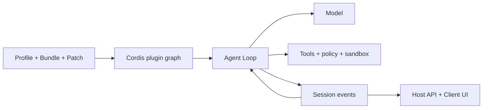

# Руководство по DeepSeek Harness

[English](README.md) | [简体中文](README_zh.md) | [繁體中文](README_tw.md) | [日本語](README_ja.md) | [한국어](README_ko.md) | [Deutsch](README_de.md) | [Español](README_es.md) | [Français](README_fr.md) | [Italiano](README_it.md) | [Português](README_pt.md) | [Русский](README_ru.md) | [العربية](README_ar.md) | [Bahasa Indonesia](README_id.md) | [ไทย](README_th.md) | [Tiếng Việt](README_vi.md)

> Многоязычное руководство для разработчиков: как понять, запустить и расширить [DeepSeek Harness](https://github.com/deepseek-ai/deepseek-harness), а затем создать на нём своего агента.

DeepSeek Harness (`dsh`) — открытый **runtime и фреймворк композиции агентов** от DeepSeek AI. Он объединяет модели, prompts, инструменты, разрешения, песочницы, сессии, субагентов, телеметрию и интерфейсы, позволяя заменять модули через общую архитектуру плагинов.

> [!IMPORTANT]
> DSH находится в предварительной версии для разработчиков и может содержать несовместимые изменения. Фиксируйте используемый коммит и сверяйтесь с [официальным репозиторием](https://github.com/deepseek-ai/deepseek-harness). Это независимый проект сообщества.

## С чего начать

| Цель | Документ |
|---|---|
| Понять архитектуру | [Техническое руководство](GUIDE_ru.md) |
| Установить, использовать и диагностировать | [Инструкция](USAGE_ru.md) |
| Разработать Agent на DSH | [Путь разработки](#разработка-agent-с-dsh) |
| Использовать coding agent | [Практические Skills](skills/) |

## Что такое DeepSeek Harness

Модель сама не управляет workspace, не запускает инструменты безопасно, не хранит Session, не запрашивает подтверждение и не предоставляет UI. Agent Harness создаёт этот рабочий слой. DSH — готовый Web Agent и одновременно фреймворк для сборки агентов программирования, исследований, эксплуатации и предметных областей.

Главный принцип — **Everything is a Plugin**. Провайдеры моделей, инструменты, Agent Loop, Session, политики, sandbox, storage и UI используют одну композиционную модель Cordis.

## Архитектура



- Context, Service, Fiber, Effect, Event и Loader управляют видимостью, зависимостями и жизненным циклом.
- Bundle распространяет конфигурацию, Profile собирает runtime, Patch хранит различия окружения.
- Agent Loop строит контекст, вызывает модель и инструменты и определяет завершение.
- Session Events — долговечный источник для воспроизведения; UI является проекцией.
- Host содержит привилегированные возможности, Client отвечает за отображение.

## Быстрый старт

```bash
npx @deepseek-ai/dsh web
```

Откройте `http://127.0.0.1:3080`, настройте модель в **Settings → Models** и выберите workspace. Перед диагностикой плагинов проверьте итоговую композицию:

```bash
dsh --profile web --dump-config
```

## Разработка Agent с DSH

1. Определите задачу, допустимые эффекты, завершение, бюджет, отмену и подтверждения.
2. Выберите Profile, добавляйте возможности через Bundles, различия храните в Patches.
3. Спроектируйте модель, Prompt, память, сжатие и видимость инструментов.
4. Разделите Tools, Services, Providers, политики и workflows на небольшие плагины.
5. Используйте существующий Agent Loop и меняйте его только при другой логике планирования или завершения.
6. Записывайте результаты, нужные модели или UI, как Session Events.
7. Размещайте runtime в Host, Web-представление в Client и соединяйте типизированным API.
8. Проверяйте mount, отказ, timeout, unload, перезапуск и rollback во временном Profile.

Tool — вызываемая моделью возможность runtime. Agent Skill инструктирует coding agent и не является плагином DSH Runtime.

## Документация проекта

- [Техническое руководство](GUIDE_ru.md): Cordis, жизненный цикл, Session, cache и безопасность.
- [Инструкция](USAGE_ru.md): установка, модули, плагины, диагностика и публикация.
- [Практические Skills](skills/): исследование, каркас плагина, инструменты и аудит.
- Полные версии: [English](README.md) и [简体中文](README_zh.md).

## Безопасность и совместимость

Фиксируйте коммиты DSH и плагинов. Проверяйте установочные скрипты, файлы, сеть, дочерние процессы и хранение данных. Dependency injection, policy, подтверждение и OS sandbox — разные границы. Не включайте реальные ключи, приватные Sessions, снимки экрана, QR-коды и контакты в документацию.

[MIT License](LICENSE)
