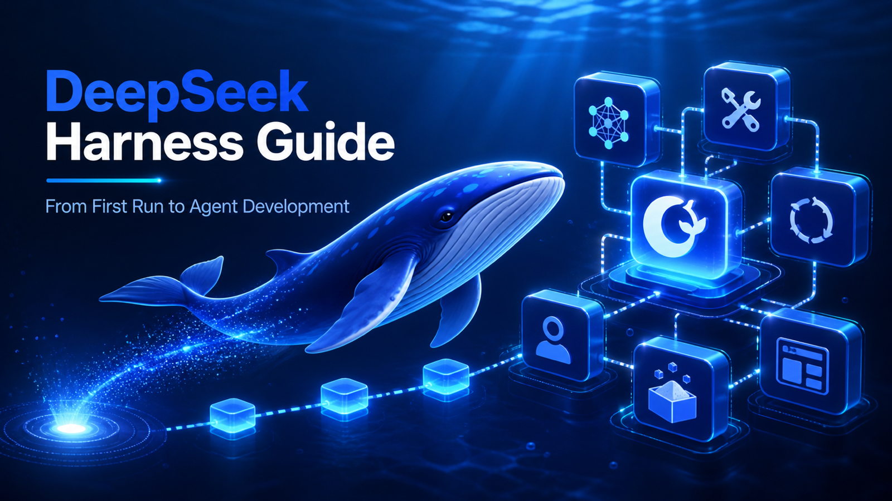
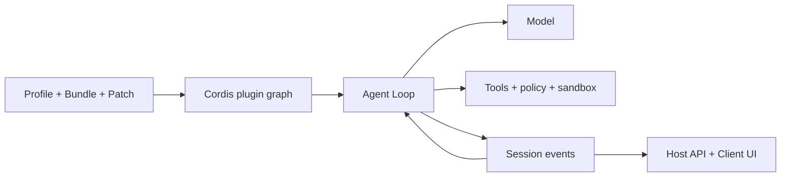

# คู่มือ DeepSeek Harness

[English](README.md) | [简体中文](README_zh.md) | [繁體中文](README_tw.md) | [日本語](README_ja.md) | [한국어](README_ko.md) | [Deutsch](README_de.md) | [Español](README_es.md) | [Français](README_fr.md) | [Italiano](README_it.md) | [Português](README_pt.md) | [Русский](README_ru.md) | [العربية](README_ar.md) | [Bahasa Indonesia](README_id.md) | [ไทย](README_th.md) | [Tiếng Việt](README_vi.md)



> คู่มือหลายภาษาสำหรับนักพัฒนาเพื่อทำความเข้าใจ เรียกใช้ และขยาย [DeepSeek Harness](https://github.com/deepseek-ai/deepseek-harness) รวมถึงสร้าง Agent ของตนเอง

DeepSeek Harness (`dsh`) คือ **Agent Runtime และเฟรมเวิร์กสำหรับประกอบระบบ** แบบโอเพนซอร์สจาก DeepSeek AI โดยเชื่อมโมเดล prompt เครื่องมือ สิทธิ์ sandbox session subagent telemetry และ UI และทำให้แต่ละโมดูลเปลี่ยนได้ผ่านสถาปัตยกรรมปลั๊กอินเดียวกัน

> [!IMPORTANT]
> DSH ยังอยู่ในช่วง Developer Preview และอาจมีการเปลี่ยนแปลงที่ไม่เข้ากัน ควรตรึง commit ที่ใช้และตรวจสอบกับ[คลังอย่างเป็นทางการ](https://github.com/deepseek-ai/deepseek-harness) คู่มือนี้เป็นโปรเจกต์ชุมชนอิสระ

## เริ่มจากตรงนี้

| เป้าหมาย | เอกสาร |
|---|---|
| เข้าใจสถาปัตยกรรม | [คู่มือเชิงเทคนิค](GUIDE_th.md) |
| ติดตั้ง ใช้งาน และแก้ปัญหา | [คู่มือการใช้งาน](USAGE_th.md) |
| พัฒนา Agent บน DSH | [ขั้นตอนการพัฒนา](#พัฒนา-agent-ด้วย-dsh) |
| ใช้ coding agent ช่วยทำงาน | [Skills ที่ใช้งานได้](skills/) |

## DeepSeek Harness คืออะไร

โมเดลเพียงอย่างเดียวไม่จัดการ workspace ไม่เรียกเครื่องมืออย่างปลอดภัย ไม่เก็บ Session ไม่ขออนุมัติ และไม่มี UI Agent Harness จึงทำหน้าที่เป็นชั้นปฏิบัติการ DSH เป็นทั้ง Web Agent ที่พร้อมใช้และเฟรมเวิร์กสำหรับประกอบ Agent ด้านการเขียนโค้ด วิจัย ปฏิบัติการ และงานเฉพาะด้าน

หลักสำคัญคือ **Everything is a Plugin** ทั้ง model provider เครื่องมือ Agent Loop, Session, policy, sandbox, storage และ UI ใช้โมเดลการประกอบของ Cordis แบบเดียวกัน

## สถาปัตยกรรม



- Context, Service, Fiber, Effect, Event และ Loader จัดการการมองเห็น dependency และวงจรชีวิต
- Bundle แจกจ่ายการตั้งค่า Profile ประกอบ runtime และ Patch เก็บความต่างของสภาพแวดล้อม
- Agent Loop สร้าง context เรียกโมเดลและเครื่องมือ และตัดสินการเสร็จสิ้น
- Session Event เป็นแหล่งข้อเท็จจริงถาวรที่ replay ได้ ส่วน UI เป็นภาพฉายของข้อมูลนี้
- Host ดูแลความสามารถที่มีสิทธิ์สูง ส่วน Client ดูแลการแสดงผล

## เริ่มต้นอย่างรวดเร็ว

```bash
npx @deepseek-ai/dsh web
```

เปิด `http://127.0.0.1:3080` ตั้งค่าโมเดลใน **Settings → Models** และเลือก workspace ก่อนตรวจสอบปลั๊กอินให้ดูองค์ประกอบจริง:

```bash
dsh --profile web --dump-config
```

## ติดตั้งและทดสอบ OpenPencil Plugin

นี่คือตัวอย่างที่ตรึงเวอร์ชันจากหน้าอ้างอิง ให้หยุด Web UI ตรวจสอบว่า `op --version` สำเร็จ และใช้ DSH เวอร์ชันเดียวกันสำหรับติดตั้ง ตรวจสอบ เริ่ม และถอนออก

```bash
npx --yes -p @deepseek-ai/dsh@0.1.0-rc.6 dsh plugin --profile web add @zseven-w/dsh-openpencil@latest
npx --yes -p @deepseek-ai/dsh@0.1.0-rc.6 dsh --profile web --dump-config
npx --yes -p @deepseek-ai/dsh@0.1.0-rc.6 dsh web
```

ใน Session ใหม่ ให้ขอสร้างและตรวจสอบเอกสาร `.op` ก่อนใช้จริงให้ตรวจผู้เผยแพร่ สิทธิ์ และความเข้ากันได้ แล้วแทน `@latest` ด้วยเวอร์ชันที่ทดสอบแน่นอน เมื่อต้องการถอน ให้หยุด UI แล้วเรียก `dsh plugin --profile web remove @zseven-w/dsh-openpencil` อ่านคำแนะนำการพัฒนา แก้ปัญหา และความปลอดภัยฉบับเต็มได้ใน [English](README.md#install-and-use-a-dsh-plugin-openpencil-example) หรือ [中文](README_zh.md#安装与使用-dsh-pluginopenpencil-示例)

## พัฒนา Agent ด้วย DSH

1. กำหนดงาน ผลข้างเคียงที่อนุญาต เงื่อนไขเสร็จ งบประมาณ การยกเลิก และการอนุมัติ
2. เลือก Profile เพิ่มความสามารถผ่าน Bundle และเก็บความต่างใน Patch
3. ออกแบบโมเดล Prompt หน่วยความจำ การย่อ และการมองเห็นเครื่องมือ
4. แยก Tool, Service, Provider, policy และ workflow เป็นปลั๊กอินขนาดเล็ก
5. ใช้ Agent Loop เดิมก่อน และเปลี่ยนเมื่อการวางแผนหรือการเสร็จสิ้นต่างจริง ๆ
6. เก็บผลที่โมเดลหรือ UI ต้องสร้างใหม่เป็น Session Event
7. วาง runtime ใน Host วาง Web UI ใน Client และเชื่อมด้วย API ที่มี type
8. ทดสอบ mount การปฏิเสธ timeout, unload, restart และ rollback ใน Profile ชั่วคราว

Tool คือความสามารถ runtime ที่โมเดลเรียก ส่วน Agent Skill คือขั้นตอนสำหรับ coding agent และไม่ใช่ปลั๊กอิน DSH Runtime

## เอกสารของโปรเจกต์

- [คู่มือเชิงเทคนิค](GUIDE_th.md): Cordis วงจรชีวิต Session cache และขอบเขตความปลอดภัย
- [คู่มือการใช้งาน](USAGE_th.md): การติดตั้ง โมดูล ปลั๊กอิน การแก้ปัญหา และการเผยแพร่
- [Skills ที่ใช้งานได้](skills/): สำรวจ source สร้างปลั๊กอิน พัฒนาเครื่องมือ และตรวจสอบความปลอดภัย
- ฉบับเต็ม: [English](README.md) และ [简体中文](README_zh.md)

## ความปลอดภัยและความเข้ากันได้

ตรึง commit ของ DSH และปลั๊กอิน ตรวจสอบสคริปต์ติดตั้ง ไฟล์ เครือข่าย subprocess และการเก็บข้อมูล Dependency injection, policy, การอนุมัติ และ OS sandbox เป็นขอบเขตแยกกัน เอกสารไม่ควรมี credential จริง Session ส่วนตัว ภาพหน้าจอ QR code หรือข้อมูลติดต่อ

## API โมเดล flaq.ai และโปรแกรมพันธมิตร

[flaq.ai](https://flaq.ai/) เป็นแพลตฟอร์มภายนอกสำหรับรวมโมเดลและ AI API นักพัฒนาที่สร้าง Agent บน DSH สามารถประเมิน [DeepSeek V4 Pro Text-to-Text](https://flaq.ai/models/deepseek/deepseek-v4-pro-text-to-text/) สำหรับการให้เหตุผล การเขียน โค้ด และการวิเคราะห์ และ [DeepSeek V4 Flash Text-to-Text](https://flaq.ai/models/deepseek/deepseek-v4-flash-text-to-text/) สำหรับการสร้างข้อความ สรุป และระบบอัตโนมัติที่รวดเร็วและคำนึงถึงต้นทุน ก่อนเชื่อมต่อควรตรวจสอบ model ID, streaming, tool calling, ราคา การจัดการข้อมูล และข้อผิดพลาดล่าสุด ข้อความนี้ไม่รับประกันความพร้อมหรือความเข้ากันได้

นักพัฒนาและผู้สร้างเนื้อหาสามารถสมัคร [โปรแกรมพันธมิตร flaq.ai](https://flaq.ai/affiliate-agreement/) ได้ โดยต้องปฏิบัติตามข้อตกลง กฎหมาย และข้อกำหนดการเปิดเผยล่าสุด และไม่มีการรับประกัน traffic ค่าคอมมิชชัน การจ่ายเงิน หรือรายได้

[MIT License](LICENSE)
