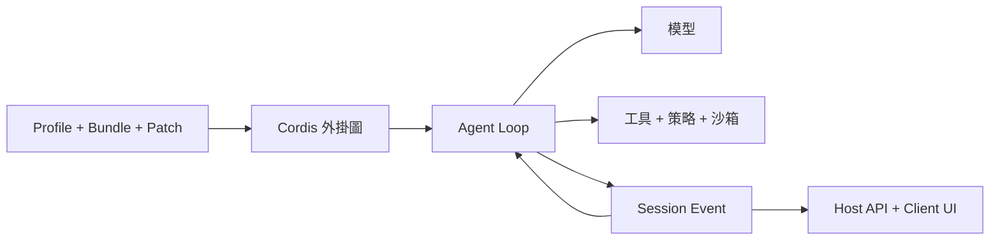

# DeepSeek Harness 指南

[English](README.md) | [简体中文](README_zh.md) | [繁體中文](README_tw.md) | [日本語](README_ja.md) | [한국어](README_ko.md) | [Deutsch](README_de.md) | [Español](README_es.md) | [Français](README_fr.md) | [Italiano](README_it.md) | [Português](README_pt.md) | [Русский](README_ru.md) | [العربية](README_ar.md) | [Bahasa Indonesia](README_id.md) | [ไทย](README_th.md) | [Tiếng Việt](README_vi.md)

> 協助 Agent 開發者理解、執行、擴充 [DeepSeek Harness](https://github.com/deepseek-ai/deepseek-harness)，並用它建構自有 Agent 的多語言指南。

DeepSeek Harness（`dsh`）是 DeepSeek AI 開源的 **Agent Runtime 與組合框架**。它把模型、提示詞、工具、權限、沙箱、工作階段、子 Agent、遙測和使用者介面組成可執行的 Agent，並讓這些模組能透過統一外掛架構替換。

> [!IMPORTANT]
> DSH 仍處於開發者預覽階段，可能出現不相容變更。請固定所使用的 Commit，並以[官方倉庫](https://github.com/deepseek-ai/deepseek-harness)為準。本指南是獨立社群專案。

## 快速導覽

| 目標 | 閱讀入口 |
|---|---|
| 理解架構 | [技術架構指南](GUIDE_tw.md) |
| 安裝、使用與排障 | [使用手冊](USAGE_tw.md) |
| 基於 DSH 開發 Agent | [Agent 開發路徑](#基於-dsh-開發-agent) |
| 使用編碼 Agent 協作 | [實用 Skills](skills/) |

## 什麼是 DeepSeek Harness

模型本身不會管理工作區、安全執行工具、保存工作階段、要求審批、處理取消或顯示 UI。Agent Harness 提供這個運行層。DSH 既能作為可直接使用的 Web Agent，也能作為組裝編碼、研究、運維或垂直領域 Agent 的框架。

它的核心理念是 **一切皆外掛**：模型 Provider、工具、Agent Loop、Session、策略、沙箱、儲存與 UI 都使用相同的 Cordis 組合機制。

## 技術架構



- **Context / Service / Fiber / Effect / Event / Loader** 管理能力可見性、依賴和生命週期。
- **Bundle** 分發設定；**Profile** 組裝可執行環境；**Patch** 覆蓋部署差異。
- **Agent Loop** 組裝上下文、請求模型、執行工具並判斷完成。
- **Session Event** 是可重放的持久事實源；UI 是它的投影。
- **Host** 負責高權限運行能力；**Client** 負責介面呈現。

## 快速使用

```bash
npx @deepseek-ai/dsh web
```

開啟 `http://127.0.0.1:3080`，在 **Settings → Models** 設定模型並選擇工作區。排查外掛前先執行：

```bash
dsh --profile web --dump-config
```

## 基於 DSH 開發 Agent

1. 定義任務邊界、允許的副作用、完成條件、預算、取消和人工審批。
2. 選擇 Profile，以 Bundle 增加能力，以 Patch 保存環境差異。
3. 設定模型、提示詞、記憶、壓縮和工具可見範圍。
4. 把 Tool、Service、Provider、策略與工作流拆成小型外掛。
5. 優先復用現有 Agent Loop；僅在規劃或完成語義不同時替換。
6. 將模型或 UI 之後仍需看到的結果寫成 Session Event。
7. Runtime 放在 Host，Web 呈現放在 Client，以型別化 API 連接。
8. 在一次性 Profile 中測試掛載、拒絕、逾時、卸載、重啟與回滾。

Tool 是模型可呼叫的 Runtime 能力；Agent Skill 是指導編碼 Agent 的工作流程，兩者不可混淆。

## 專案資料

- [技術架構](GUIDE_tw.md)：Cordis、生命週期、Session、快取與安全邊界。
- [使用手冊](USAGE_tw.md)：安裝、模組分類、外掛開發、排障與發布檢查。
- [實用 Skills](skills/)：原始碼探索、外掛腳手架、工具開發與安全審查。
- [完整簡體中文首頁](README_zh.md)與[完整英文首頁](README.md)。

## 安全與相容性

固定 DSH 與外掛 Commit；審查安裝腳本、檔案、網路、子行程與資料保留；分開處理依賴注入、策略、使用者審批與作業系統沙箱。文件不包含真實憑證、私有工作階段、截圖、QR Code 或聯絡方式。生態清單收錄不代表安全背書。

本專案使用 [MIT License](LICENSE)。
