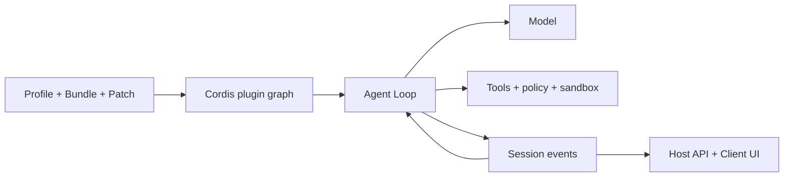

# Hướng dẫn DeepSeek Harness

[English](README.md) | [简体中文](README_zh.md) | [繁體中文](README_tw.md) | [日本語](README_ja.md) | [한국어](README_ko.md) | [Deutsch](README_de.md) | [Español](README_es.md) | [Français](README_fr.md) | [Italiano](README_it.md) | [Português](README_pt.md) | [Русский](README_ru.md) | [العربية](README_ar.md) | [Bahasa Indonesia](README_id.md) | [ไทย](README_th.md) | [Tiếng Việt](README_vi.md)

> Hướng dẫn đa ngôn ngữ giúp developer hiểu, chạy và mở rộng [DeepSeek Harness](https://github.com/deepseek-ai/deepseek-harness), rồi xây dựng Agent riêng trên nền tảng này.

DeepSeek Harness (`dsh`) là **Agent Runtime và framework tổ hợp** mã nguồn mở của DeepSeek AI. DSH kết nối mô hình, prompt, công cụ, quyền, sandbox, phiên, subagent, telemetry và giao diện, đồng thời cho phép thay thế từng mô-đun bằng kiến trúc plugin chung.

> [!IMPORTANT]
> DSH đang ở giai đoạn Developer Preview và có thể có thay đổi không tương thích. Hãy ghim commit sử dụng và kiểm tra [kho chính thức](https://github.com/deepseek-ai/deepseek-harness). Đây là dự án hướng dẫn cộng đồng độc lập.

## Bắt đầu từ đây

| Mục tiêu | Tài liệu |
|---|---|
| Hiểu kiến trúc | [Hướng dẫn kỹ thuật](GUIDE_vi.md) |
| Cài đặt, sử dụng và xử lý lỗi | [Hướng dẫn sử dụng](USAGE_vi.md) |
| Phát triển Agent trên DSH | [Lộ trình phát triển](#phát-triển-agent-với-dsh) |
| Dùng coding agent hỗ trợ | [Skills thực dụng](skills/) |

## DeepSeek Harness là gì

Mô hình đơn lẻ không quản lý workspace, không chạy công cụ an toàn, không lưu Session, không xin phê duyệt và không cung cấp UI. Agent Harness cung cấp lớp vận hành đó. DSH vừa là Web Agent có thể dùng ngay, vừa là framework để lắp ghép Agent lập trình, nghiên cứu, vận hành và chuyên ngành.

Nguyên tắc chính là **Everything is a Plugin**. Model provider, công cụ, Agent Loop, Session, policy, sandbox, storage và UI đều dùng chung mô hình tổ hợp Cordis.

## Kiến trúc



- Context, Service, Fiber, Effect, Event và Loader quản lý phạm vi, phụ thuộc và vòng đời.
- Bundle phân phối cấu hình, Profile tổ hợp runtime, Patch giữ khác biệt môi trường.
- Agent Loop xây dựng ngữ cảnh, gọi mô hình và công cụ, rồi quyết định hoàn tất.
- Session Event là nguồn dữ kiện bền vững có thể phát lại; UI là một phép chiếu.
- Host giữ năng lực đặc quyền, Client đảm nhiệm trình bày.

## Bắt đầu nhanh

```bash
npx @deepseek-ai/dsh web
```

Mở `http://127.0.0.1:3080`, cấu hình mô hình trong **Settings → Models** và chọn workspace. Trước khi chẩn đoán plugin, kiểm tra tổ hợp thực tế:

```bash
dsh --profile web --dump-config
```

## Phát triển Agent với DSH

1. Xác định nhiệm vụ, tác động được phép, điều kiện hoàn tất, ngân sách, hủy và phê duyệt.
2. Chọn Profile, thêm năng lực bằng Bundle và giữ khác biệt trong Patch.
3. Thiết kế mô hình, Prompt, bộ nhớ, compact và phạm vi công cụ.
4. Tách Tool, Service, Provider, policy và workflow thành plugin nhỏ.
5. Ưu tiên Agent Loop hiện có; chỉ thay khi logic lập kế hoạch hoặc hoàn tất thực sự khác.
6. Ghi kết quả mà mô hình hoặc UI cần dựng lại thành Session Event.
7. Đặt runtime trong Host, giao diện Web trong Client và nối bằng API có kiểu.
8. Kiểm thử mount, từ chối, timeout, unload, restart và rollback trong Profile tạm thời.

Tool là năng lực runtime do mô hình gọi. Agent Skill hướng dẫn coding agent và không phải plugin DSH Runtime.

## Tài liệu dự án

- [Hướng dẫn kỹ thuật](GUIDE_vi.md): Cordis, vòng đời, Session, cache và bảo mật.
- [Hướng dẫn sử dụng](USAGE_vi.md): cài đặt, mô-đun, plugin, xử lý lỗi và phát hành.
- [Skills thực dụng](skills/): khám phá nguồn, dựng plugin, phát triển công cụ và rà soát bảo mật.
- Bản đầy đủ: [English](README.md) và [简体中文](README_zh.md).

## Bảo mật và tương thích

Ghim commit DSH và plugin. Kiểm tra script cài đặt, tệp, mạng, tiến trình con và lưu giữ dữ liệu. Dependency injection, policy, phê duyệt người dùng và OS sandbox là các ranh giới riêng. Không đưa thông tin xác thực thật, Session riêng tư, ảnh chụp, mã QR hoặc liên hệ vào tài liệu.

[MIT License](LICENSE)
