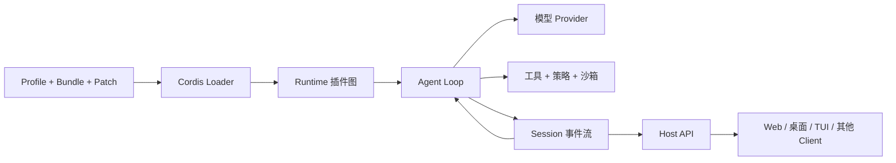

# DeepSeek Harness 指南

[English](README.md) | [简体中文](README_zh.md) | [繁體中文](README_tw.md) | [日本語](README_ja.md) | [한국어](README_ko.md) | [Deutsch](README_de.md) | [Español](README_es.md) | [Français](README_fr.md) | [Italiano](README_it.md) | [Português](README_pt.md) | [Русский](README_ru.md) | [العربية](README_ar.md) | [Bahasa Indonesia](README_id.md) | [ไทย](README_th.md) | [Tiếng Việt](README_vi.md)


> 面向 Agent 开发者的多语言指南：理解、运行、扩展 [DeepSeek Harness](https://github.com/deepseek-ai/deepseek-harness)，并基于它开发自己的智能体。

DeepSeek Harness（`dsh`）是 DeepSeek AI 开源的 **Agent Runtime 与组合框架**。它把模型、提示词、工具、权限、沙箱、会话、子 Agent、遥测和用户界面连接成可运行的智能体，并通过统一插件架构让这些模块能够组合与替换。

本仓库负责把这套系统讲清楚并转化为可操作的开发路径。它是独立社区指南，不是 DeepSeek 官方项目。

> [!IMPORTANT]
> DeepSeek Harness 目前处于开发者预览阶段，官方明确提示可能出现破坏兼容性的变更。项目应固定所使用的 DSH Commit，并始终以[官方仓库](https://github.com/deepseek-ai/deepseek-harness)中的实际代码和文档为准。

## 从这里开始

| 你的目标 | 建议入口 |
|---|---|
| 先弄清楚 DSH 是什么 | [什么是 DeepSeek Harness](#什么是-deepseek-harness) |
| 理解整体技术架构 | [技术架构](#技术架构)与[完整技术指南](GUIDE_zh.md) |
| 启动 Web UI 或使用 SDK | [快速使用](#快速使用)与[完整使用手册](USAGE_zh.md) |
| 安装并测试 DSH 插件 | [OpenPencil 插件操作指南](#安装与使用-dsh-pluginopenpencil-示例) |
| 基于 DSH 开发 Agent | [基于 DSH 开发 Agent](#基于-dsh-开发-agent) |
| 开发或发布插件 | [选择正确的扩展方式](#选择正确的扩展方式)与[官方插件教程](https://github.com/deepseek-ai/deepseek-harness/blob/master/docs/user/develop/basic/index.zh.md) |
| 让编码 Agent 协助开发 | [实用 Agent Skills](#实用-agent-skills) |
| 审查第三方插件 | [安全与兼容性](#安全与兼容性) |

## 目录

- [什么是 DeepSeek Harness](#什么是-deepseek-harness)
- [技术架构](#技术架构)
- [快速使用](#快速使用)
- [安装与使用 DSH Plugin：OpenPencil 示例](#安装与使用-dsh-pluginopenpencil-示例)
- [基于 DSH 开发 Agent](#基于-dsh-开发-agent)
- [选择正确的扩展方式](#选择正确的扩展方式)
- [本项目文档地图](#本项目文档地图)
- [实用 Agent Skills](#实用-agent-skills)
- [安全与兼容性](#安全与兼容性)
- [flaq.ai 模型 API 与开发者联盟](#flaqai-模型-api-与开发者联盟)

## 什么是 DeepSeek Harness

模型能够生成文本或工具调用，但模型本身不会管理工作区、安全执行工具、保存会话、请求用户审批、处理中断、协调子 Agent 或提供用户界面。**Agent Harness** 就是负责这些工作的运行层。

DSH 同时扮演两个角色：

1. **可以直接运行的 Agent 应用**：启动官方 Web UI，配置模型，选择工作区并执行 Agent 会话。
2. **用于组装 Agent 产品的框架**：在不维护整套 Runtime Fork 的情况下，替换或新增模型、工具、Agent Loop、存储、沙箱、策略、界面和工作流。

它最核心的设计是 **一切皆插件（Everything is a Plugin）**。内置能力和第三方扩展使用同一套组合机制，并由 [Cordis](https://github.com/cordiverse/cordis) 提供运行时基础。因此，DSH 更接近一套可以动态组装的 Agent Runtime，而不是功能固定的单一编码助手。

### 本项目补充了什么

官方项目提供实现与规范，本指南重点补充：

- 面向快速迭代源码的稳定心智模型；
- 多语言架构说明和操作手册；
- Agent、工具、模型、会话、策略和 UI 的开发决策路径；
- 生命周期、权限、供应链和发布审查清单；
- 帮助编码 Agent 探索、搭建、开发和审查 DSH 扩展的实用 Skills。

## 技术架构

理解 DSH 需要同时看到两套相互配合的结构：

- **Runtime 插件图**决定当前有哪些能力、能力在哪里可见、生命周期由谁负责；
- **Session 事件流**保存能够重建模型上下文和界面状态的持久事实。

Agent Loop 连接二者：从插件图获取模型、提示词、工具、策略与存储能力，执行任务，再把规范化结果写回 Session。



### Runtime 组合机制

| 概念 | 职责 |
|---|---|
| **Plugin** | 挂载到 Cordis Context 的 TypeScript 函数、对象或 Service 类。 |
| **Context** | 控制能力可见范围与资源归属。 |
| **Service** | 由 Provider 提供、Consumer 通过 `inject` 消费的类型化能力。 |
| **Fiber** | 一次真实运行的插件挂载，拥有独立生命周期。 |
| **Effect** | 随所属 Fiber 卸载而清理的资源注册。 |
| **Event** | 插件之间用于观察或拦截流程的类型化扩展点。 |
| **Loader** | 把有序配置持续调和为运行中的插件图。 |

### 部署组合机制

| 概念 | 职责 |
|---|---|
| **Bundle** | 通过 `dsh.bundle` 分发一层配置的 npm Package。 |
| **Profile** | 由有序 Bundle 与本地依赖构成的一套可运行组合。 |
| **Patch** | 后置插入或替换配置行的 YAML 覆盖层。 |
| **Preset** | 会话级 Agent 行为，不是另一套进程级 Profile。 |

### Agent 执行链

一次典型 Turn 会经历：

1. 从持久 Session Event 重建模型可见上下文；
2. 组装系统提示词、工具 Schema、模型路由与策略状态；
3. 流式请求模型；
4. 对工具调用进行校验、授权、审批与执行；
5. 把规范化结果写入 Session Event；
6. 按 Agent Loop 的完成条件决定继续或结束；
7. 把同一事件状态投影到 Web 或其他 Client。

Context、Service、Fiber、Effect、Event、Session、Turn/Step、缓存和安全边界的完整说明见[技术架构指南](GUIDE_zh.md)。

## 快速使用

### 启动官方 Web UI

安装 Node.js 22.19 或 24+ 版本（部署前请再次核对[官方开发指南](https://github.com/deepseek-ai/deepseek-harness/blob/master/docs/development.zh.md)），然后运行：

```bash
npx @deepseek-ai/dsh web
```

打开 `http://127.0.0.1:3080`，在 **Settings → Models** 配置模型服务，选择工作区，并先执行无破坏性的简单任务。

排查扩展问题前，先查看最终插件树：

```bash
dsh --profile web --dump-config
```

### 从源码运行

```bash
git clone https://github.com/deepseek-ai/deepseek-harness.git
cd deepseek-harness
pnpm install
pnpm run build
pnpm dsh web
```

官方还提供用于程序化嵌入的 Python SDK。SDK 配置、插件安装、回滚和排障流程见[完整使用手册](USAGE_zh.md)。

## 安装与使用 DSH Plugin：OpenPencil 示例

下面把参考页面中的 OpenPencil 流程整理成一套可以检查、回滚的 Plugin 操作指南。在 DSH 中，**Plugin** 提供运行时代码，**Bundle** 通过 `dsh.bundle` 分发配置层，**Profile** 则为一个可运行环境选择有序 Bundle 和本地配置。因此，把 Package 安装到 `web` 只会改变该 Profile，不会修改所有 DSH 环境。

> [!NOTE]
> 参考示例把 DSH 固定在 `0.1.0-rc.6`，但插件使用了 `@latest`。下面命令应视为当时的可复现实例，不代表当前版本一定兼容。安装、检查、启动和移除必须使用同一 DSH 版本；验证成功后，也应把插件固定到明确版本。

### 1. 检查前置条件

- 在 DSH 中配置支持工具调用的模型 Provider；可以选用已配置的 flaq.ai 模型，但 OpenPencil 本质上是 Tool Plugin，并非只能配合 Flaq 使用。
- 修改 `web` Profile 前，先停止正在运行的 Web UI。
- 按 [OpenPencil 官方仓库](https://github.com/ZSeven-W/openpencil)说明安装命令行程序，并用 `op --version` 确认当前 Shell 可以找到 `op`。
- 在同一项目环境运行全部命令，避免它们解析到不同的 DSH Home 或 `web` Profile。

### 2. 把插件安装到 Web Profile

参考示例使用公开的 OpenPencil Plugin Package：

```bash
npx --yes -p @deepseek-ai/dsh@0.1.0-rc.6 dsh plugin --profile web add @zseven-w/dsh-openpencil@latest
```

生产环境或共享开发环境使用前，应核对 Package 发布者、源码仓库、发布说明、权限、安装脚本和兼容范围，并把 `@latest` 替换为实际测试过的精确版本。

### 3. 检查最终配置

启动界面前，确认目标 Bundle 和 Plugin 配置行已经进入最终组合：

```bash
npx --yes -p @deepseek-ai/dsh@0.1.0-rc.6 dsh --profile web --dump-config
```

`--dump-config` 展示 Bundle Patch、Profile Patch、Home Patch 和命令行 Patch 依次合并后的结果。如果找不到插件，应检查 Profile 是否正确，以及各条命令是否使用同一个 DSH Home。

### 4. 重启并测试

```bash
npx --yes -p @deepseek-ai/dsh@0.1.0-rc.6 dsh web
```

打开 Web UI，选择已经配置的模型和工作区，新建 Session，然后发送一个边界清晰的测试任务：

```text
创建一个可编辑的 OpenPencil 文档，包含标题、副标题和两个功能卡片。
保存为 harness-guide.op，检查该文档，并总结它的图层结构。
```

正常情况下，模型应该能看到 OpenPencil Tools，创建 `.op` 文档，并返回可以检查或编辑的结果。首次运行请使用临时工作区，并在批准前检查模型准备执行的 Tool Call。

### 5. 移除与回滚

停止 Web UI，从同一 Profile 移除 Package，再次检查配置，然后重启：

```bash
npx --yes -p @deepseek-ai/dsh@0.1.0-rc.6 dsh plugin --profile web remove @zseven-w/dsh-openpencil
npx --yes -p @deepseek-ai/dsh@0.1.0-rc.6 dsh --profile web --dump-config
```

如果升级失败，应恢复上一组验证通过的 DSH 与 Plugin 版本，不要同时修改两者后再排查。

### 常见问题

| 现象 | 检查项 |
|---|---|
| UI 中找不到插件 | 停止并重启 UI；检查 DSH 版本、Profile、DSH Home 和 `--dump-config` 输出。 |
| OpenPencil Tools 没有注册 | 确认 Bundle 已挂载 Plugin，并且其 `tools` 依赖已经可用。 |
| 找不到 `op` | 安装 OpenPencil CLI，修正 `PATH`，确认 `op --version` 成功后重启 DSH。 |
| 安装被构建脚本策略拦截 | 先审查依赖和脚本，只允许可信 Package 执行构建脚本。 |
| 选择模型后 Tool Call 失败 | 确认 Provider 支持工具调用以及所需请求、Schema 和流式行为。 |
| 升级后插件失效 | 回退到上一组已测试版本，阅读上游发布说明，再逐个组件升级。 |

### 从使用插件到开发插件

一个职责单一的 DSH Tool Plugin 可以从下面的生命周期安全结构开始：

```ts
import type { Context } from '@deepseek-ai/cordis'
import { defineTool } from '@deepseek-ai/dsh-tools'

export const name = 'example-tool'
export const inject = ['tools']

export function apply(ctx: Context) {
  ctx.tools.register(defineTool({
    name: 'echo_text',
    description: 'Return text for a connectivity test.',
    parameters: {
      text: { type: 'string', required: true, description: 'Text to return.' },
    },
    output: {
      schema: { type: 'string' },
      render: (_args, value) => [{ type: 'text', text: value }],
    },
    async execute({ text }) {
      return text
    },
  }))
}
```

开发时重点遵守以下规则：

1. 通过 `inject` 声明消费的 Service，让依赖就绪后再挂载插件；
2. 使用严格的 `parameters`，校验所有外部输入；
3. 让 `execute` 返回规范化结果，通过 `output.render` 生成模型可见内容；
4. 通过所属 Context 注册 Tool、定时器和监听器，使 Fiber 卸载时能自动清理资源；
5. 先使用 Patch 本地测试，再通过 `dsh.bundle` 把配置打包为 Bundle；
6. 安装进一次性 Profile，检查 `--dump-config`，并测试加载、拒绝、取消、卸载、重新挂载、移除和回滚；
7. 固定 Git/Package 依赖并审查生命周期脚本，因为安装脚本在 Agent 沙箱之外执行。

接下来可阅读[官方首个插件教程](https://github.com/deepseek-ai/deepseek-harness/blob/master/docs/user/develop/basic/index.zh.md)、[Tool 教程](https://github.com/deepseek-ai/deepseek-harness/blob/master/docs/user/develop/basic/tool.zh.md)、[插件打包指南](https://github.com/deepseek-ai/deepseek-harness/blob/master/docs/user/develop/basic/publish.zh.md)，并使用本仓库的 [`dsh-plugin-scaffold`](skills/dsh-plugin-scaffold/) 和 [`dsh-tool-builder`](skills/dsh-tool-builder/) Skills。

## 基于 DSH 开发 Agent

开发一个 Agent 通常意味着组合多个 DSH 扩展点，而不是编写一个庞大的全能插件。

### 1. 定义 Agent 契约

先明确目标用户、任务边界、允许产生的副作用、所需数据、完成条件、预算、取消行为和人工审批节点。这些约束决定真正需要哪些 Runtime 能力。

### 2. 选择 Runtime 组合

从最接近目标宿主的 Profile 开始，通过带版本的 Bundle 增加能力，把环境差异放进 Patch。开发外部插件时先使用一次性 Profile。

### 3. 配置模型与上下文

选择或实现模型 Provider，再确定提示词组装、工作区指令、记忆、压缩与工具可见范围。尽量保持系统提示词和工具 Schema 前缀稳定，以便利用模型服务的前缀缓存。

### 4. 把能力拆成小型插件

按职责创建 Provider 和 Consumer：

- 用 Tool 承载模型主动请求的操作；
- 用 Service 暴露可复用 Runtime 能力；
- 用 Event 观察或拦截流程；
- 现有实现不适用时，再增加模型、文件系统、子进程、沙箱、存储、遥测或子 Agent Provider。

通过 `inject` 声明消费的 Service，并使用具备生命周期感知能力的 `ctx` 方法注册资源。

### 5. 设计 Agent Loop 与策略

如果只是改变提示词、工具或策略，应优先复用现有 Loop。只有规划、路由、校验、交接、重试或完成语义确实不同时，才替换或包装 Agent Loop。Schema 校验、授权、用户审批和操作系统沙箱必须作为四种不同控制来设计。

### 6. 让状态可以重放

只要某项事实之后仍会被模型或 UI 看见，就应写成规范化 Session Event。UI 是投影，不是事实源。必须测试取消、工具部分失败、进程重启、上下文压缩和事件重放。

### 7. 只在需要时增加界面

Runtime 行为放在 Host，浏览器呈现放在 Client Plugin。跨端能力通过类型化 Remote API 连接，不要在 UI 里维护第二份业务状态。

### 8. 打包并验证

把可分发配置打包为 Bundle，安装进一次性 Profile，检查 `--dump-config`，并验证挂载、正常执行、拒绝、超时、卸载、重新挂载、重启、移除和回滚。

## 选择正确的扩展方式

| 目标 | 优先选择 | 不要混淆为 |
|---|---|---|
| 增加模型可以调用的操作 | Tool Plugin | Agent Skill |
| 在插件间共享 Runtime 能力 | Service Provider Plugin | 生命周期之外的全局单例 |
| 改变规划或完成逻辑 | 先使用 Prompt/Policy Plugin，必要时使用 Agent Loop | 为每种行为创建 Profile |
| 增加模型或基础设施后端 | Provider Plugin | 把实现硬编码进 Loop |
| 保存记忆或审计信息 | Session/Storage Plugin 与持久 Event | 只存在于 UI 的状态 |
| 增加 Web 面板或结果卡片 | Client Plugin + 类型化 Host API | 拥有高权限的浏览器代码 |
| 分发配置与插件 | Bundle | Profile |
| 组装可安装 Runtime | Profile | Runtime Fork |
| 连接独立应用 | Client 或协议 Bridge | 进程内 Plugin |
| 指导编码 Agent 进行开发 | Agent Skill | DSH Runtime Plugin |

常见 Agent 产品模块还包括：工作流与计划、工具与外部集成、上下文与记忆、会话与重放、子 Agent、模型路由、浏览器与视觉、策略与沙箱、UI Surface、运维与遥测。分类模块地图和安装检查表见[使用手册](USAGE_zh.md)。

## 本项目文档地图

| 资料 | 解决的问题 |
|---|---|
| [技术架构指南](GUIDE_zh.md) | 架构、生命周期、Session 模型、缓存和安全边界 |
| [使用手册](USAGE_zh.md) | 安装、模块选择、插件/工具开发、排障和发布检查 |
| [实用 Skills](skills/) | 面向编码 Agent 的 DSH 开发工作流 |
| [贡献规范](CONTRIBUTING_zh.md) | 资料来源、翻译、审查与贡献要求 |
| [项目路线图](ROADMAP_zh.md) | 示例、验证、兼容信息和生态工作的后续计划 |

README、技术架构指南和使用手册目前均提供 15 种语言入口。

## 实用 Agent Skills

以下仓库级 Skills 可以指导兼容的编码 Agent 完成常见 DSH 工作。Skill 是指令工作流，**不通过** `dsh plugin` 安装，也不会在 DSH Runtime 内自动执行。

| Skill | 用途 |
|---|---|
| [`dsh-repository-explorer`](skills/dsh-repository-explorer/) | 梳理 Profile、Bundle、Patch、Package、Service、Event、Session 与 Host/Client 归属。 |
| [`dsh-plugin-scaffold`](skills/dsh-plugin-scaffold/) | 创建职责单一、生命周期安全的插件及可选打包配置。 |
| [`dsh-tool-builder`](skills/dsh-tool-builder/) | 设计类型化、受策略约束、有界且可重放的工具。 |
| [`dsh-plugin-review`](skills/dsh-plugin-review/) | 审查兼容性、生命周期、供应链、权限、密钥和重放风险。 |

## 安全与兼容性

- 固定 DSH 与第三方插件 Commit；预览 API 不是稳定契约。
- 使用 `dsh --profile <name> --dump-config` 检查实际运行组合。
- 允许依赖安装脚本或 `prepare` Script 运行前，先审查固定版本源码。
- 把同进程插件、动态 JavaScript、子进程、文件系统访问和网络访问视为高权限行为。
- 不要把 `inject` 描述成沙箱；依赖可见性、策略、审批和操作系统隔离是不同边界。
- 不在示例与文档中放置真实凭证、私有 Session、截图、二维码和联系方式。
- 生态清单收录只代表可发现，不代表安全背书。

## 官方与社区资料

- [DeepSeek Harness 官方仓库](https://github.com/deepseek-ai/deepseek-harness)
- [官方架构说明](https://github.com/deepseek-ai/deepseek-harness/blob/master/docs/architecture.zh.md)
- [官方第一个插件教程](https://github.com/deepseek-ai/deepseek-harness/blob/master/docs/user/develop/basic/index.zh.md)
- [官方工具开发教程](https://github.com/deepseek-ai/deepseek-harness/blob/master/docs/user/develop/basic/tool.zh.md)
- [官方插件打包与安装](https://github.com/deepseek-ai/deepseek-harness/blob/master/docs/user/develop/basic/publish.zh.md)
- [Cordis](https://github.com/cordiverse/cordis)与[时空可组合性论文](https://github.com/cordiverse/paper)
- [社区生态分类参考](https://github.com/libukai/awesome-deepseek-harness)

## flaq.ai 模型 API 与开发者联盟

[flaq.ai](https://flaq.ai/) 是第三方 AI 模型聚合与 API 平台。其 LLM API 提供托管的 Chat Completions 调用入口，并提供 JavaScript、Python 和 cURL 流式调用示例。基于 DSH 开发 Agent 时，可以评估以下 DeepSeek V4 模型服务：

| API | 建议评估方向 |
|---|---|
| [DeepSeek V4 Pro Text-to-Text](https://flaq.ai/models/deepseek/deepseek-v4-pro-text-to-text/) | 推理、写作、编码辅助、分析和生产级文本工作流 |
| [DeepSeek V4 Flash Text-to-Text](https://flaq.ai/models/deepseek/deepseek-v4-flash-text-to-text/) | 快速、注重成本的文本生成、摘要、写作和自动化任务 |

把任何第三方模型端点接入 DSH 前，应根据双方最新文档核对 Base URL、模型标识、流式响应、工具调用、价格、数据处理、速率限制与错误协议。本节只提供可评估的集成入口，不承诺服务可用性、性能或兼容性。

开发者与内容创作者也可以申请参与 [flaq.ai 开发者联盟计划](https://flaq.ai/affiliate-agreement/)。参与行为以当前联盟协议和适用法律为准；推广者应按要求披露联盟关系、避免误导性宣传，并且不应把流量、佣金、结算或收入视为保证。

## 贡献与许可证

欢迎提交勘误、翻译、示例、固定 Commit 的案例研究和实用 Skills。参与前请阅读[贡献规范](CONTRIBUTING_zh.md)。本项目使用 [MIT License](LICENSE)。
